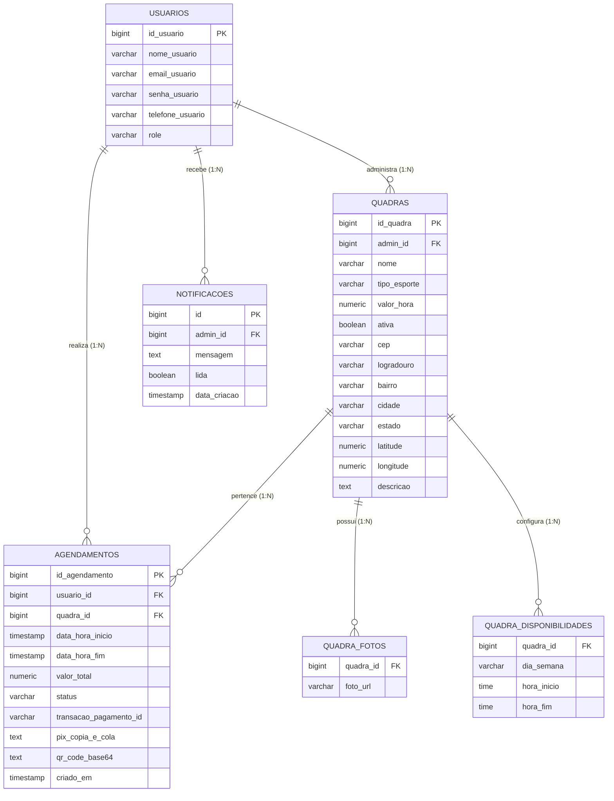

<p align="center">
  
</p>

<h1 align="center">eQuadras - Plataforma de Gestão e Agendamento Esportivo</h1>

<p align="center">
  <strong>Sistema moderno, resiliente e escalável para locação de quadras esportivas com horários dinâmicos de funcionamento, agendamento concorrente com lock pessimista, pagamento instantâneo via Pix e notificações em tempo real.</strong>
</p>

<p align="center">
  
  
  
  
  
  
  
</p>

---

## 📌 Sumário
1. [Visão Geral](#-visão-geral)
2. [Arquitetura do Sistema](#-arquitetura-do-sistema)
3. [Stack Tecnológica](#-stack-tecnológica)
4. [Integrações com APIs Externas](#-integrações-com-apis-externas)
5. [Estrutura do Banco de Dados](#-estrutura-do-banco-de-dados)
6. [Estratégia de Índices e Performance do Banco](#-estratégia-de-índices-e-performance-do-banco)
7. [Destaques de Segurança & Resiliência](#-destaques-de-segurança--resiliência)
8. [Novas Funcionalidades: Horários e Disponibilidade por Quadra](#-novas-funcionalidades-horários-e-disponibilidade-por-quadra)
9. [Design System & Interface](#-design-system--interface)
10. [Guia de Instalação e Execução](#-guia-de-instalação-e-execução)
11. [Endpoints Principais da API](#-endpoints-principais-da-api)
12. [Variáveis de Ambiente](#-variáveis-de-ambiente)
13. [Licença & Autoria](#-licença--autoria)

---

## 📖 Visão Geral

O **eQuadras** foi desenvolvido para solucionar a burocracia no agendamento e administração de quadras esportivas (Futebol, Beach Tennis, Tênis, Futsal, Vôlei e Basquete). 

A plataforma divide-se em dois portais integrados:
- **Portal do Atleta (Cliente):** Busca de quadras com geolocalização e raio em KM (via CEP e coordenadas geográficas), galeria com carrossel de fotos, detalhes da estrutura, modal inteligente com seletor de dias ativos (com bloqueio automático de dias fechados), geração de Pix copia e cola com QR Code em tempo real e histórico completo de reservas (Ativas, Realizadas e Canceladas).
- **Painel Administrativo (Proprietário):** Gestão de quadras (CRUD completo, upload seguro de até 5 fotos por quadra, alternância de status ativo/inativo), configuração personalizada de dias da semana e horários de abertura/fechamento por quadra, métricas financeiras (faturamento total, reservas do dia), calendário interativo, controle de cancelamentos e central de notificações em tempo real via **Server-Sent Events (SSE)**.

---

## 🏗 Arquitetura do Sistema

O projeto segue a arquitetura em camadas orientada a domínio (Clean Architecture / Domain-Driven Design simplificado), com separação estrita de responsabilidades:

```text
equadras/
├── src/main/java/com/agendamentos/equadras/
│   ├── config/              # Configurações globais (CORS, Security, Static Resources, Gzip)
│   ├── controller/          # Endpoints REST e SSE Controllers
│   ├── dto/                 # Data Transfer Objects (Requests e Responses)
│   ├── exception/           # Global Exception Handler (RFC 7807 Problem Details)
│   ├── model/
│   │   ├── entity/          # Entidades JPA (Usuario, Quadra, DisponibilidadeDia, Agendamento, Notificacao)
│   │   └── enums/           # Enums de domínio (Role, StatusAgendamento, TipoEsporte)
│   ├── repository/          # Interfaces Spring Data JPA com queries otimizadas
│   ├── security/            # Autenticação stateless JWT (Filter, Service, @UsuarioLogado resolver)
│   └── service/             # Regras de negócio, transações, locks e pagamentos
└── frontend/
    ├── src/
    │   ├── api/             # Camada de comunicação HTTP com interceptor JWT
    │   ├── components/      # Componentes visuais atômicos e reutilizáveis
    │   ├── contexts/        # Gerenciamento de estado global (AuthContext)
    │   ├── pages/           # Telas (ClientDashboard, AdminDashboard, AuthPage)
    │   └── types/           # Tipagens estritas TypeScript
```

---

## ⚡ Stack Tecnológica

### Backend
- **Java 21 LTS** com suporte a **Virtual Threads (Project Loom)** ativado para altíssima concorrência com baixo consumo de memória.
- **Spring Boot 3.4.x** (Spring Data JPA, Spring Web MVC, Spring Validation, Spring Security 6).
- **PostgreSQL 16+** como banco relacional principal.
- **JJWT (io.jsonwebtoken 0.12.x):** Autenticação stateless HMAC-SHA com claims tipadas.
- **Server-Sent Events (SSE):** Notificações push unidirecionais em tempo real para o admin.
- **RFC 7807 (Problem Details):** Tratamento padronizado de exceções HTTP.

### Frontend
- **React 18** com **TypeScript 5**.
- **Vite 5:** Code splitting dinâmico com `React.lazy()` e carregamento assíncrono de rotas.
- **Tailwind CSS 3:** Estilização utilitária com Design System escuro (`#09090b` Zinc-950) e foco em acessibilidade WCAG AA.
- **Lucide React:** Conjunto de ícones vetoriais modernos.

---

## 🌐 Integrações com APIs Externas

| API / Serviço | Tipo / Protocolo | Finalidade no Sistema | Implementação |
|---|---|---|---|
| **Mercado Pago Payments API** | REST / HTTPS (`v1/payments`) | Criação de cobranças Pix com QR Code base64 e código Copia e Cola, chave de idempotência e fallback dinâmico para ambiente de testes. | [`PagamentoService.java`](src/main/java/com/agendamentos/equadras/service/PagamentoService.java) |
| **ViaCEP API** | REST / JSON (`viacep.com.br/ws/{cep}/json/`) | Autocomplete de endereço completo (Logradouro, Bairro, Cidade, UF) a partir do CEP. | [`ClientDashboard.tsx`](frontend/src/pages/ClientDashboard.tsx) / [`AdminDashboard.tsx`](frontend/src/pages/AdminDashboard.tsx) |
| **OpenStreetMap / Nominatim API** | REST / JSON (`nominatim.openstreetmap.org/search`) | Geocodificação de endereços em Latitude e Longitude, viabilizando busca por proximidade via Fórmula de Haversine. | [`ClientDashboard.tsx`](frontend/src/pages/ClientDashboard.tsx) |
| **Google Maps Navigation** | Deep Linking / Web | Abertura direta da rota e localização da quadra a partir das coordenadas geográficas. | [`CourtDetailsModal.tsx`](frontend/src/components/ui/CourtDetailsModal.tsx) |

---

## 🗄 Estrutura do Banco de Dados



---

## ⚡ Estratégia de Índices e Performance do Banco

Para assegurar tempos de resposta sub-milissegundo sob alta carga concorrente e evitar varreduras de tabela inteira (*Full Table Scans*), os seguintes índices foram implementados estrategicamente:

| Índice | Tabela / Colunas | Objetivo & Impacto de Performance |
|---|---|---|
| `idx_quadra_admin` | `quadras(admin_id)` | Acelera a listagem de quadras pertencentes a um administrador específico no painel de controle. |
| `idx_quadra_ativa` | `quadras(ativa)` | Filtra rapidamente quadras disponíveis para agendamento dos atletas, ignorando quadras inativadas. |
| `idx_quadras_lat_lng` | `quadras(latitude, longitude)` | Otimiza consultas de geolocalização e cálculo do raio de busca (Fórmula de Haversine / Bounding Box). |
| `idx_quadra_fotos_quadra_id` | `quadra_fotos(quadra_id)` | Otimiza o carregamento em lote (`@BatchSize(size = 50)`) da galeria de fotos de cada quadra. |
| `idx_quadra_disp_quadra_id` | `quadra_disponibilidades(quadra_id)` | Permite resolução instantânea da grade de dias e horários de funcionamento ao abrir o agendamento. |
| `idx_notificacoes_admin_data` | `notificacoes(admin_id, data_criacao DESC)` | Acelera o histórico de notificações em ordem cronológica reversa da central do admin. |
| `idx_agendamento_quadra_status_datas` | `agendamentos(quadra_id, status, data_hora_inicio, data_hora_fim)` | Permite que a checagem de conflitos (`existeConflitoHorario` com `EXISTS`) seja resolvida exclusivamente no índice sem tocar nas páginas de dados do disco. |

### Otimizações Adicionais de Camada de Dados:
- **`spring.jpa.open-in-view=false`**: Conexões com o banco são devolvidas imediatamente ao pool HikariCP após a finalização do serviço, evitando travamentos por conexões presas na renderização.
- **Desacoplamento de HTTP sob Lock Transacional**: Chamadas externas síncronas ao gateway de pagamento Mercado Pago são executadas **fora** do bloco de transação com Lock Pessimista (`FOR UPDATE`), liberando o banco enquanto a rede aguarda resposta.
- **Gzip Compression**: Ativado no Spring Boot para payloads JSON acima de 1KB, reduzindo o tráfego de rede em até 70%.

---

## 🔒 Destaques de Segurança & Resiliência

1. **Autenticação Stateless JWT com Claims de Perfil:**
   - Tokens assinados (HS256) emitidos no login/cadastro.
   - O `@UsuarioLogado` extrai a identidade e a Role (`ROLE_ADMIN` / `ROLE_CLIENT`) direto do token autenticado, impedindo falsificação de identidade por headers manuais.
2. **Prevenção de Colisão e Double Booking:**
   - Validação atômica sob Lock Pessimista (`buscarComLockParaAgendamento`) impedindo reservas duplicadas no mesmo segundo.
3. **Armazenamento Seguro de Imagens:**
   - Sanitização de arquivos no [`FileStorageService.java`](src/main/java/com/agendamentos/equadras/service/FileStorageService.java), validação de MIME types (`image/jpeg`, `image/png`, `image/webp`), limite de 5MB e geração de nomes UUID randômicos para proteção contra Path Traversal.
4. **Tratamento Amigável de Exclusões e Integridade Referencial:**
   - O `GlobalExceptionHandler` intercepta violações de chave estrangeira (`DataIntegrityViolationException` e `IllegalStateException`), instruindo o usuário a inativar quadras que já contenham histórico de reservas.

---

## 🗓 Funcionalidades: Horários, Disponibilidade e Bloqueios por Quadra

A plataforma conta com gestão granular de horários, sazonalidade e bloqueios pontuais:

- **Horários de Funcionamento Semanais:** O administrador define individualmente os dias em que a quadra opera (Segunda a Domingo) e a faixa horária de funcionamento (ex: Segunda a Sexta das 08h às 22h, Sábado das 08h às 18h e Domingo Fechado).
- **Data Limite de Agendamento:** Permite estipular um prazo final (ex: término de contrato ou temporada), bloqueando automaticamente reservas em datas posteriores.
- **Bloqueios Pontuais e Manutenções:**
  - O administrador pode bloquear um dia inteiro (ex: reformas, feriados) ou horários específicos de uma data (ex: 14h às 16h).
  - Suporte inteligente com aviso de confirmação caso tente bloquear horários específicos em um dia com bloqueio total pré-existente (substituindo o dia todo apenas pelo intervalo desejado).
- **Experiência do Atleta:**
  - Carrossel dinâmico dos próximos 14 dias calcula a disponibilidade em tempo real.
  - Dias fechados, com bloqueio total ou após a data limite ficam desabilitados com badges claras (**"Fechado"**, **"Bloqueado"**, **"Encerrado"**).
- **Segurança Transacional:** Validações atômicas sob Lock Pessimista no backend rejeitam qualquer tentativa de agendamento em horários bloqueados ou fora de funcionamento.

---

## 🎨 Arquitetura do Frontend e Modularização

O frontend foi totalmente refatorado sob o paradigma de **Componentes Atômicos e Container/Presentational**:
- `AdminDashboard.tsx`: Reduzido em mais de 60% em linhas de código, atuando exclusivamente como container de estado, autenticação e SSE.
- Subcomponentes especializados em `frontend/src/components/admin/`:
  - `AdminMetricsGrid.tsx`: Exibição de KPIs e métricas de faturamento.
  - `CalendarOccupancy.tsx`: Calendário mensal completo com filtros de status (`TODOS`, `LIVRES`, `AGENDADOS`, `BLOQUEADOS`).
  - `CourtManagementList.tsx`: Grid de quadras cadastradas com ações rápidas de ativação, edição e bloqueio.
  - `DayAgendaModal.tsx`: Modal da agenda do dia com toggle entre grade horária e lista de reservas detalhada.
  - `CourtBlockModal.tsx`: Criação e remoção de bloqueios pontuais com confirmação.
  - `CourtFormModal.tsx`: Cadastro e edição completa de quadras (fotos, CEP e grade semanal).
- Otimização de chamadas HTTP consolidando listagens em lote (`GET /quadras/bloqueios` e `GET /agendamentos/dia`).

---

## 🎨 Design System & Interface

- **Tema:** Dark mode com paleta base Zinc (`#09090b` Zinc-950, `#18181b` Zinc-900, `#27272a` Zinc-800) e destaque em esmeralda vibrante (`#34d399` Emerald-400).
- **Navegação em Abas:** Na visão do cliente, as seções **"Explorar Quadras"** e **"Minhas Reservas"** são divididas no topo em abas dedicadas com badge em tempo real de reservas ativas.
- **Responsividade Mobile:** Seletor de modalidades adaptado em dropdown no celular e botões touch-friendly com microinterações de clique e transições suaves.

---

## 🚀 Guia de Instalação e Execução

### Pré-requisitos
- **Java 21 JDK** instalado
- **Node.js 18+** e **npm** instalados
- **PostgreSQL 14+** rodando localmente

---

### 1. Clonar o Repositório
```bash
git clone https://github.com/GuilhermeAizzaSano/eQuadras.git
cd eQuadras
```

---

### 2. Configurar o Banco de Dados PostgreSQL
Crie um banco de dados vazio:
```sql
CREATE DATABASE equadras_db;
```

---

### 3. Executar o Backend (Spring Boot)
```bash
# Windows (PowerShell)
$env:JAVA_HOME = "C:\Program Files\Java\jdk-25.0.2"; .\mvnw.cmd spring-boot:run

# Linux / macOS
./mvnw spring-boot:run
```
O servidor backend iniciará na porta **`8080`** (`http://localhost:8080`).

---

### 4. Executar o Frontend (React + Vite)
Abra outro terminal:
```bash
cd frontend
npm install
npm run dev
```
O frontend estará acessível em: **`http://localhost:3000`** (ou `http://localhost:5173`).

---

## 📡 Endpoints Principais da API

| Método | Rota | Descrição | Autenticação |
|---|---|---|:---:|
| `POST` | `/usuarios` | Registro de novos atletas | Pública |
| `POST` | `/usuarios/login` | Login e emissão do JWT | Pública |
| `GET` | `/quadras` | Listagem de quadras (filtros de esporte, CEP, lat/lng e raio) | Opcional |
| `POST` | `/quadras` | Cadastro de quadra com horários de funcionamento e data limite | `ROLE_ADMIN` |
| `PUT` | `/quadras/{id}` | Edição dos dados, horários e data limite da quadra | `ROLE_ADMIN` |
| `PATCH` | `/quadras/{id}/status` | Alternar status ativo/inativo | `ROLE_ADMIN` |
| `DELETE` | `/quadras/{id}` | Exclusão de quadra | `ROLE_ADMIN` |
| `POST` | `/quadras/{id}/fotos` | Upload de fotos (máx. 5 fotos) | `ROLE_ADMIN` |
| `DELETE` | `/quadras/{id}/fotos` | Remoção de foto | `ROLE_ADMIN` |
| `GET` | `/quadras/bloqueios` | Listagem consolidada de todos os bloqueios do admin | `ROLE_ADMIN` |
| `POST` | `/quadras/{id}/bloqueios` | Criar bloqueio de horário ou dia inteiro | `ROLE_ADMIN` |
| `DELETE` | `/quadras/{quadraId}/bloqueios/{id}` | Remover bloqueio por ID | `ROLE_ADMIN` |
| `POST` | `/quadras/{quadraId}/desbloquear` | Desbloquear horários/dias via payload | `ROLE_ADMIN` |
| `GET` | `/agendamentos/dia` | Consulta consolidada de slots de todas as quadras do admin | `ROLE_ADMIN` |
| `GET` | `/agendamentos/quadra/{id}/horarios-disponiveis` | Consulta de slots dinâmicos da quadra por data | Autenticado |
| `GET` | `/agendamentos` | Listagem de agendamentos do usuário logado | Autenticado |
| `POST` | `/agendamentos` | Agendamento atômico e geração do Pix | Autenticado |
| `PATCH` | `/agendamentos/{id}/cancelar` | Cancelamento de agendamento | Autenticado |
| `POST` | `/pagamentos/{id}/simular-aprovacao` | Simulação de aprovação Pix (dev/testes) | Autenticado |
| `GET` | `/notificacoes/admin` | Listagem de notificações do admin | `ROLE_ADMIN` |
| `GET` | `/notificacoes/stream` | Stream SSE de notificações em tempo real | `ROLE_ADMIN` |

---

## 📚 Documentação da API

A documentação técnica detalhada de todas as rotas, payloads, regras e exemplos está consolidada no documento:
- 📖 **Guia Completo da API:** [`docs/api/API_DOCUMENTATION.md`](docs/api/API_DOCUMENTATION.md)
- 🖥️ **Swagger UI Local:** [`http://localhost:8080/swagger-ui/index.html`](http://localhost:8080/swagger-ui/index.html)
- 📄 **OpenAPI Schema (JSON ao vivo):** [`http://localhost:8080/v3/api-docs`](http://localhost:8080/v3/api-docs)
- 🌐 **Portal Online:** [https://equadras.readme.io/reference](https://equadras.readme.io/reference)
- 🔐 **Token Fixo de Testes Administrativos:** `equadras_master_admin_token_2026_secret_key_fixed` (Admin ID 52).

---

## ⚙️ Variáveis de Ambiente

Configure as variáveis de ambiente necessárias copiando o modelo `.env.example`:

```env
# Banco de Dados
SPRING_DATASOURCE_URL=jdbc:postgresql://localhost:5432/equadras_db
SPRING_DATASOURCE_USERNAME=postgres
SPRING_DATASOURCE_PASSWORD=sua_senha

# Autenticação JWT (mínimo 32 caracteres)
JWT_SECRET=sua_chave_secreta_super_segura_com_no_minimo_32_bytes
JWT_EXPIRACAO_MS=28800000

# Gateway de Pagamento
MERCADOPAGO_ACCESS_TOKEN=TEST-...

# CORS
EQUADRAS_CORS_ORIGENS=http://localhost:3000,http://localhost:5173
```

---

## 👨‍💻 Autoria & Licença

Desenvolvido por **[Guilherme Aizza Sano](https://github.com/GuilhermeAizzaSano)**.

Distribuído sob a licença MIT. Consulte `LICENSE` para mais detalhes.
