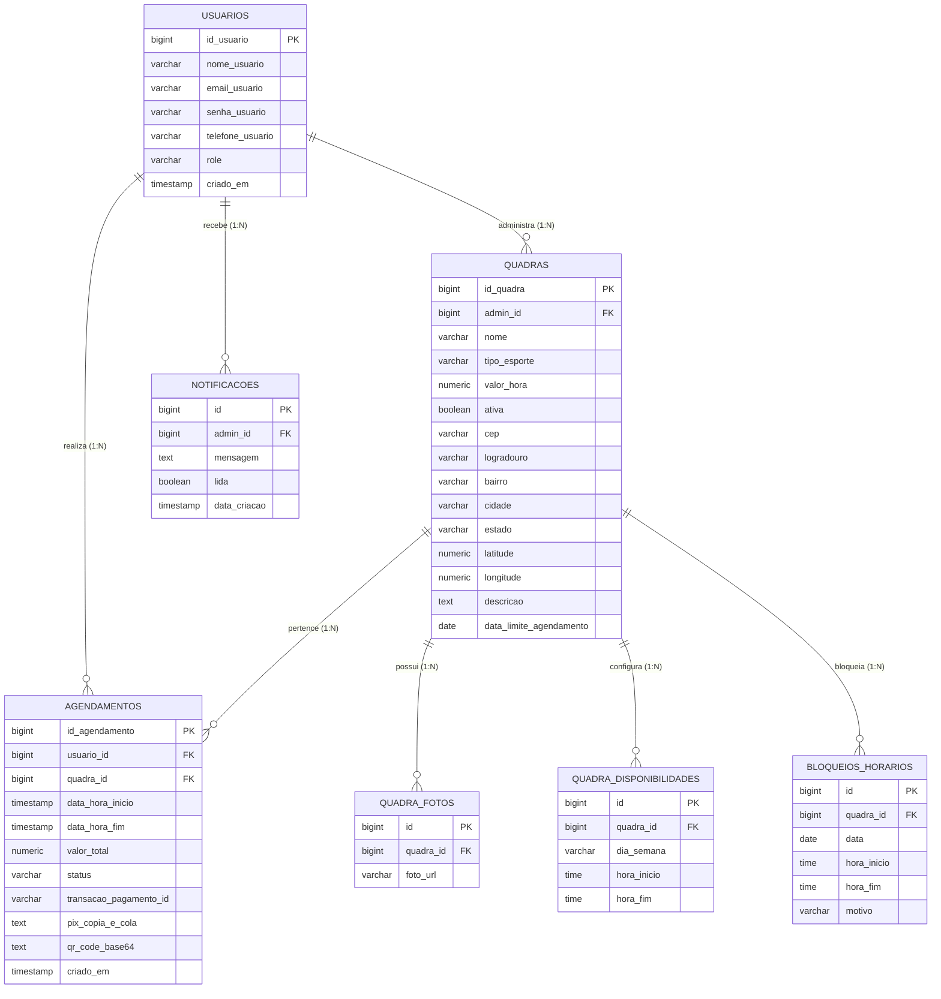

<p align="center">
  
</p>

<h1 align="center">eQuadras - Plataforma de Gestão e Agendamento Esportivo</h1>

<p align="center">
  <strong>Plataforma moderna, resiliente e escalável para locação e gestão de quadras esportivas com grade diária interativa, calendário mensal de ocupação, agendamento concorrente com lock pessimista, pagamento instantâneo via Pix e notificações em tempo real.</strong>
</p>

<p align="center">
  <a href="https://equadras.app"></a>
  
  
  
  
  
  
  
</p>

<p align="center">
  🌐 <strong>Ambiente Online Oficial:</strong> <a href="https://equadras.app">https://equadras.app</a> (ou <a href="https://www.equadras.app">https://www.equadras.app</a>)<br/>
  📖 <strong>Swagger UI (Produção):</strong> <a href="https://equadras.app/swagger-ui/index.html">https://equadras.app/swagger-ui/index.html</a><br/>
  📄 <strong>OpenAPI JSON Spec:</strong> <a href="https://equadras.app/v3/api-docs">https://equadras.app/v3/api-docs</a><br/>
  📚 <strong>Guia Técnico da API:</strong> <a href="docs/api/API_DOCUMENTATION.md">docs/api/API_DOCUMENTATION.md</a>
</p>

---

## 📌 Sumário
1. [Visão Geral](#-visão-geral)
2. [Acesso em Produção (Novo Domínio DNS)](#-acesso-em-produção-novo-domínio-dns)
3. [Destaques das Funcionalidades Recentes](#-destaques-das-funcionalidades-recentes)
4. [Módulos da Plataforma](#-módulos-da-plataforma)
   - [4.1 Portal do Atleta (Cliente)](#41-portal-do-atleta-cliente)
   - [4.2 Painel Administrativo (Gestor de Quadras)](#42-painel-administrativo-gestor-de-quadras)
   - [4.3 Painel Master Admin](#43-painel-master-admin)
5. [Arquitetura do Sistema e Código](#-arquitetura-do-sistema-e-código)
6. [Stack Tecnológica Completa](#-stack-tecnológica-completa)
7. [Modelo de Dados e Diagrama ER](#-modelo-de-dados-e-diagrama-er)
8. [Estratégia de Índices e Performance](#-estratégia-de-índices-e-performance)
9. [Segurança, Concorrência e Resiliência](#-segurança-concorrência-e-resiliência)
10. [Integrações Externas](#-integrações-externas)
11. [Otimizações de Performance e Rede](#-otimizações-de-performance-e-rede)
12. [Infraestrutura, Deploy e Automação](#-infraestrutura-deploy-e-automação)
13. [Guia de Instalação e Execução Local](#-guia-de-instalação-e-execução-local)
14. [Endpoints Principais da API](#-endpoints-principais-da-api)
15. [Variáveis de Ambiente](#-variáveis-de-ambiente)
16. [Licença e Autoria](#-licença-e-autoria)

---

## 📖 Visão Geral

O **eQuadras** é uma solução completa desenvolvida para transformar a locação e administração de complexos esportivos (Futebol Society, Beach Tennis, Tênis, Futsal, Vôlei e Basquete). 

A plataforma resolve os principais gargalos tradicionais: conflitos de reservas simultâneas, falta de visibilidade da agenda diária, cobranças manuais e atrasos em confirmações. Ela oferece agendamento atômico em tempo real com **Lock Pessimista no banco**, emissão de **Pix dinâmico** com integração direta ao Mercado Pago, painel visual com **Grade Diária em Timeline**, **Calendário Mensal de Ocupação** e **Server-Sent Events (SSE)** para sincronização instantânea.

---

## 🌐 Acesso em Produção (Novo Domínio DNS)

O sistema está implantado e disponível publicamente sob o domínio oficial com terminação segura TLS/HTTPS via Let's Encrypt:

- **Aplicação Web (Frontend):** [https://equadras.app](https://equadras.app)
- **Domínio Alternativo:** [https://www.equadras.app](https://www.equadras.app)
- **Documentação Swagger UI ao Vivo:** [https://equadras.app/swagger-ui/index.html](https://equadras.app/swagger-ui/index.html)
- **OpenAPI 3 Spec (JSON):** [https://equadras.app/v3/api-docs](https://equadras.app/v3/api-docs)

---

## 🚀 Destaques das Funcionalidades Recentes

1. **Grade Diária Visual (Timeline Grid):**
   - Visualização horizontal interativa das 06:00 às 23:00 para todas as quadras.
   - Identificação cromática de status: **Livre** (verde), **Agendado** (azul), **Bloqueado** (âmbar) e **Passado/Realizado** (cinza translúcido).
   - Indicador dinâmico de hora atual em tempo real com linha tracejada e badge de horário.
   - Ação rápida ao clicar no slot: abre detalhes da reserva ou atalho para bloqueio/desbloqueio.

2. **Diferenciação Estrita entre "Confirmados" e "Realizados":**
   - Correção de semântica temporal: uma reserva paga e ativa permanece como **Confirmada** até o término do horário do agendamento, tornando-se **Realizada** apenas após sua conclusão.
   - Filtros específicos na barra de ferramentas e no calendário de ocupação mensal para auditar históricos de partidas concluídas.

3. **Agenda do Dia Sob Demanda (`DayAgendaModal`):**
   - Modal com alternância entre grade e lista de reservas detalhadas.
   - A sub-aba **Ativos** lista imediatamente os jogos vigentes do dia.
   - As sub-abas **Realizados** e **Cancelados** apresentam cards com contadores e botão de carregamento sob demanda (*"Carregar Realizados (X)"* / *"Carregar Cancelados (X)"*), prevenindo renderizações pesadas e poluição visual.

4. **Central de Notificações em Tempo Real com Ação em Lote:**
   - Conexão contínua Server-Sent Events (SSE) notificando o administrador imediatamente após aprovação do pagamento Pix.
   - Novo botão **"Marcar tudo como lido"**, executando atualização atômica no banco de dados e refletindo de imediato na interface.

5. **Otimizações Extremas de Performance e Rede:**
   - **Preservação de Abas no DOM:** No painel do cliente, alternar entre *"Explorar Quadras"* e *"Minhas Reservas"* utiliza alternância CSS (`hidden`), eliminando destruição do DOM e reprocessamento desnecessário de imagens.
   - **Lazy Loading de Dados:** A requisição de horários e a listagem de usuários do Master Admin são carregadas sob demanda estritamente quando o usuário acessa as respectivas telas.
   - **Migração do Banco para São Paulo:** Conexão migrada para a região `sa-east-1` (São Paulo) no Supabase, reduzindo a latência de consultas SQL de ~180ms para menos de 15ms.

---

## 🎯 Módulos da Plataforma

### 4.1 Portal do Atleta (Cliente)
- **Busca por Geolocalização & CEP:** Integração com ViaCEP e OpenStreetMap/Nominatim calculando a distância exata em raio de até 10 km (Fórmula de Haversine).
- **Filtros por Modalidade:** Futebol Society, Beach Tennis, Tênis, Futsal, Vôlei e Basquete.
- **Detalhes da Quadra (`CourtDetailsModal`):** Galeria com carrossel de fotos em alta resolução, lista de comodidades, endereço completo e deep link para navegação no Google Maps.
- **Seletor de Agendamento Inteligente (`BookingModal`):** Carrossel dos próximos 14 dias calculando disponibilidade dinâmica; bloqueio automático de dias fechados ou posteriores à data limite.
- **Seleção de Slots Contíguos:** Seleção de múltiplos horários consecutivos com cálculo automático do valor proporcional.
- **Pagamento Pix em Tempo Real:** Geração instantânea de QR Code base64 e chave Copia e Cola Mercado Pago, com contador regressivo de 15 minutos para expiração do Pix.
- **Gestão de Reservas:** Visualização categorizada de reservas ativas, histórico de jogos concluídos e cancelamentos com liberação imediata da quadra.

### 4.2 Painel Administrativo (Gestor de Quadras)
- **KPIs e Métricas Financeiras:** Faturamento total acumulado, receita do dia, total de agendamentos e taxa de ocupação das quadras.
- **Próximas Partidas de Hoje:** Barra de visualização rápida com os jogos agendados para as próximas 4 horas.
- **Barra de Ferramentas da Agenda:** Navegação por data (dia anterior/próximo, seletor de calendário e atalho *"Hoje"*), alternador entre Grade Diária e Visão Mensal, filtro por quadra, pílulas de status e busca em tempo real por atleta ou telefone.
- **Calendário Mensal de Ocupação:** Visão global de ocupação do mês com barras de status diárias e clique para abertura da data.
- **Gestão Completa de Quadras:** Cadastro e edição de dados, upload de até 5 fotos por quadra, alternância de status ativo/inativo e exclusão segura com proteção contra violação de chave estrangeira.
- **Horários e Sazonalidade Semanal:** Definição personalizada de dias da semana de funcionamento (Segunda a Domingo) e horários de abertura/fechamento por quadra.
- **Gestão de Bloqueios Pontuais:** Bloqueio de horários específicos ou dias inteiros (reformas, feriados) com detecção e substituição inteligente de bloqueios totais.
- **Central de Notificações:** Histórico de notificações push com marcação individual ou coletiva como lidas.

### 4.3 Painel Master Admin
- **Gestão de Usuários do Sistema:** Listagem completa de atletas e administradores cadastrados com suporte a busca instantânea.
- **Controle de Acessos:** Criação e edição de usuários com definição de papéis (`ROLE_CLIENT` e `ROLE_ADMIN`).
- **Carregamento Otimizado (Lazy Load):** A lista de usuários só é requisitada ao entrar explicitamente na aba de gestão.

---

## 🏗 Arquitetura do Sistema e Código

O backend adota o padrão em camadas desacopladas (Clean Architecture / Domain-Driven Design simplificado):

```text
equadras/
├── src/main/java/com/agendamentos/equadras/
│   ├── config/              # CORS, Security, Swagger/OpenAPI, Virtual Threads e Gzip
│   ├── controller/          # Controllers REST (Quadras, Agendamentos, Notificações, Usuários, Pagamentos)
│   ├── dto/                 # Requests e Responses com validações Jakarta Validation
│   ├── exception/           # Global Exception Handler (RFC 7807 Problem Details)
│   ├── model/
│   │   ├── entity/          # Entidades JPA (Usuario, Quadra, DisponibilidadeDia, Agendamento, Notificacao, BloqueioHorario)
│   │   └── enums/           # Role, StatusAgendamento, TipoEsporte, DiaSemana
│   ├── repository/          # Spring Data JPA Repositories com índices e queries nativas otimizadas
│   ├── security/            # Filtro JWT stateless, gerador de tokens e @UsuarioLogado resolver
│   └── service/             # Regras de negócio, transações sob lock pessimista e gateway de pagamentos
├── frontend/
│   ├── src/
│   │   ├── api/             # Camada de comunicação HTTP unificada (apiClient.ts)
│   │   ├── components/      # Componentes modulares
│   │   │   ├── admin/       # Subcomponentes do painel administrativo (Timeline, Calendar, Modais, Toolbar)
│   │   │   └── ui/          # Componentes visuais atômicos (Badge, ModalPix, ConfirmModal, BookingModal)
│   │   ├── contexts/        # AuthContext para gerenciamento de sessão e token
│   │   ├── pages/           # ClientDashboard, AdminDashboard, AuthPage
│   │   ├── types/           # Tipagens TypeScript estritas
│   │   └── utils/           # Formatadores de data local e geolocalização
│   ├── dist/                # Build de produção otimizado com Vite
│   └── nginx.conf           # Configuração de proxy reverso e SPA fallback
├── docs/
│   └── api/                 # Documentação detalhada da API REST (API_DOCUMENTATION.md)
├── restart.ps1              # Script PowerShell para restart e build automático local e nuvem
└── restart.sh               # Script Bash equivalente para ambientes Unix
```

---

## ⚡ Stack Tecnológica Completa

| Camada | Tecnologia | Versão | Destaque de Engenharia |
|---|---|---|---|
| **Linguagem / Runtime** | Java OpenJDK | 21 LTS | Virtual Threads (Project Loom) ativadas para alta escalabilidade |
| **Framework Backend** | Spring Boot | 3.4.x | Spring Data JPA, Spring Security 6, Spring Validation, Tomcat 11 |
| **Banco de Dados** | PostgreSQL | 17 (Supabase) | Hospedado na região de São Paulo (`sa-east-1`) com latência < 15ms |
| **Pool de Conexões** | HikariCP | Integrado | Pool resiliente com `leakDetectionThreshold` e `open-in-view=false` |
| **Segurança / Auth** | JJWT (io.jsonwebtoken) | 0.12.x | Autenticação stateless HMAC-SHA256 com claims tipadas |
| **Tempo Real** | Server-Sent Events (SSE) | HTTP/1.1 | Notificações push unidirecionais sem overhead de polling |
| **Frontend Framework** | React | 18.3.x | Arquitetura funcional com Hooks customizados e abas montadas |
| **Linguagem Frontend**| TypeScript | 5.x | Tipagem estrita de contratos DTOs e entidades |
| **Estilização** | Tailwind CSS | 3.4.x | Design system Zinc-950 com alto contraste e acessibilidade WCAG |
| **Build Tool** | Vite | 5.4.x | HMR ultrarrápido, minificação Terser e code-splitting |
| **Servidor Web / Proxy**| Nginx | 1.24+ | Proxy reverso, gzip, suporte a SSE sem buffer e SSL Let's Encrypt |
| **Hospedagem em Nuvem** | Oracle Cloud Infrastructure | Ubuntu 24.04 | VM Always Free com systemd gerenciando o serviço Java |

---

## 🗄 Modelo de Dados e Diagrama ER



---

## ⚡ Estratégia de Índices e Performance

Para garantir tempos de resposta sub-milissegundo em consultas analíticas e transacionais, índices estratégicos foram aplicados:

| Índice | Tabela / Colunas | Finalidade & Impacto |
|---|---|---|
| `idx_quadra_admin` | `quadras(admin_id)` | Otimiza listagem das quadras pertencentes a cada gestor. |
| `idx_quadra_ativa` | `quadras(ativa)` | Filtra rapidamente quadras aptas para reserva no catálogo. |
| `idx_quadras_lat_lng` | `quadras(latitude, longitude)` | Acelera a consulta de proximidade geográfica por raio em KM. |
| `idx_quadra_fotos_quadra_id` | `quadra_fotos(quadra_id)` | Garante resolução veloz do carregamento de galerias em lote. |
| `idx_quadra_disp_quadra_id` | `quadra_disponibilidades(quadra_id)` | Otimiza a montagem da grade semanal de disponibilidade. |
| `idx_bloqueios_quadra_data` | `bloqueios_horarios(quadra_id, data)` | Filtra bloqueios ativos no cálculo de disponibilidade do dia. |
| `idx_agendamento_quadra_status_datas` | `agendamentos(quadra_id, status, data_hora_inicio, data_hora_fim)` | Permite que a checagem de colisão concorrente (`EXISTS`) seja resolvida exclusivamente no índice (Index-Only Scan). |
| `idx_notificacoes_admin_data` | `notificacoes(admin_id, data_criacao DESC)` | Acelera o histórico de notificações em ordem cronológica reversa. |

---

## 🔒 Segurança, Concorrência e Resiliência

1. **Prevenção de Double Booking via Lock Pessimista:**
   - O método `buscarComLockParaAgendamento` no repositório bloqueia a linha da quadra com cláusula `SELECT ... FOR UPDATE` durante a validação da janela horária, garantindo atomicidade absoluta mesmo sob centenas de requisições simultâneas.
2. **Autenticação Stateless JWT e Injeção por Anotação:**
   - Filtro `JwtAuthenticationFilter` intercepta requisições validando a assinatura do token. O argumento `@UsuarioLogado UsuarioAutenticado` injeta o usuário autenticado diretamente nos controllers, eliminando a dependência de IDs manuais passados no corpo da requisição.
3. **Resiliência no Gateway de Pagamento:**
   - A chamada ao Mercado Pago é executada fora do bloco transacional de lock do banco, liberando a conexão de banco enquanto aguarda a resposta da rede externa.
   - Em caso de indisponibilidade do gateway externo, o sistema ativa fallback inteligente com geração determinística de chave Pix para garantir continuidade operacional.
4. **Tratamento Global de Exceções (RFC 7807):**
   - Respostas de erro padronizadas em `application/problem+json` detalhando mensagens de validação e regras de negócio violadas.

---

## 🌐 Integrações Externas

- **Mercado Pago Payments API (`v1/payments`):** Criação de pagamentos Pix com QR Code e chave copia-e-cola com chave de idempotência.
- **ViaCEP API (`viacep.com.br/ws/{cep}/json`):** Autocomplete automático de endereços no cadastro de quadras e no filtro de busca do atleta.
- **OpenStreetMap / Nominatim API (`nominatim.openstreetmap.org/search`):** Geocodificação de endereços para obtenção de coordenadas e cálculo de distância.
- **Google Maps Navigation:** Abertura da rota direta para a quadra a partir das coordenadas geográficas.

---

## ⚡ Otimizações de Performance e Rede

1. **Abas sem Reprocessamento de DOM:** As abas do cliente usam alternância por classes CSS `hidden`, mantendo as quadras e fotos em memória no DOM, sem recarregar recursos ao navegar entre telas.
2. **Carregamento Sob Demanda:**
   - A grade de horários de quadras só é consultada quando o usuário abre o modal de agendamento.
   - Usuários do sistema (Master Admin) são consultados apenas ao clicar na aba correspondente.
   - Históricos de jogos realizados e cancelados na agenda do dia utilizam carregamento sob demanda com contadores visuais.
3. **Migração do Banco de Dados para São Paulo:** O banco Supabase foi migrado para a região `sa-east-1` (São Paulo), reduzindo drasticamente o RTT de rede.
4. **Gzip Compression:** Compressão ativada no Nginx e no Spring Boot para tráfego JSON e assets estáticos.

---

## 🚀 Infraestrutura, Deploy e Automação

### Arquitetura de Servidor (Nuvem Oracle Cloud)
- **Instância:** Ubuntu Linux com systemd gerenciando o serviço `equadras-backend.service`.
- **Reverse Proxy Nginx:**
  - Serve os arquivos estáticos compilados do frontend em `/home/ubuntu/eQuadras/frontend/dist`.
  - Encaminha requisições de `/usuarios`, `/quadras`, `/agendamentos`, `/notificacoes`, etc., para `http://127.0.0.1:8080`.
  - Configurado com `proxy_buffering off` e timeouts estendidos para suporte contínuo a Server-Sent Events (SSE).
- **Certificados SSL:** Let's Encrypt gerenciados pelo Certbot com renovação automática.

### Scripts de Automação de Deploy
A raiz do repositório contém scripts prontos para sincronizar e reiniciar os serviços remotamente:

```powershell
# Reiniciar backend e frontend na nuvem
powershell -ExecutionPolicy Bypass -File .\restart.ps1

# Fazer build do frontend e reiniciar todos os serviços
powershell -ExecutionPolicy Bypass -File .\restart.ps1 -Build

# Limpar processos locais (Java/Vite)
powershell -ExecutionPolicy Bypass -File .\restart.ps1 -Local
```

*(No Linux/macOS, utilize o script equivalente `./restart.sh`)*.

---

## 💻 Guia de Instalação e Execução Local

### Pré-requisitos
- **Java 21 JDK** instalado e configurado no `PATH`
- **Node.js 18+** e **npm**
- **PostgreSQL 14+** em execução

### 1. Clonar o Repositório
```bash
git clone https://github.com/GuilhermeAizzaSano/eQuadras.git
cd eQuadras
```

### 2. Configurar o Banco de Dados
```sql
CREATE DATABASE equadras_db;
```

### 3. Executar o Backend (Spring Boot)
```bash
# Windows
.\mvnw.cmd spring-boot:run

# Linux / macOS
./mvnw spring-boot:run
```
O backend estará ativo em `http://localhost:8080`.

### 4. Executar o Frontend (React + Vite)
Em outro terminal:
```bash
cd frontend
npm install
npm run dev
```
O frontend estará acessível em `http://localhost:3000` (ou `http://localhost:5173`).

---

## 📡 Endpoints Principais da API

| Método | Endpoint | Permissão | Descrição |
|---|---|:---:|---|
| `POST` | `/usuarios` | Público | Cadastro de novo atleta |
| `POST` | `/usuarios/login` | Público | Login e emissão de token JWT |
| `GET` | `/usuarios` | `ROLE_ADMIN` | Listagem de usuários (Master Admin) |
| `GET` | `/quadras` | Público | Listar quadras (filtros de esporte, CEP e raio KM) |
| `POST` | `/quadras` | `ROLE_ADMIN` | Cadastrar quadra com horários e data limite |
| `PUT` | `/quadras/{id}` | `ROLE_ADMIN` | Editar dados cadastrais e grade de funcionamento |
| `PATCH`| `/quadras/{id}/status` | `ROLE_ADMIN` | Alternar quadra entre ativa e inativa |
| `POST` | `/quadras/{id}/fotos` | `ROLE_ADMIN` | Upload de até 5 fotos |
| `GET` | `/quadras/bloqueios` | `ROLE_ADMIN` | Listar todos os bloqueios do gestor em lote |
| `POST` | `/quadras/{id}/bloqueios` | `ROLE_ADMIN` | Criar bloqueio de dia inteiro ou intervalo horária |
| `GET` | `/agendamentos/dia` | `ROLE_ADMIN` | Horários consolidados de todas as quadras para a data |
| `GET` | `/agendamentos/quadra/{id}/horarios-disponiveis` | Público | Grade com status dinâmico dos slots da quadra |
| `POST` | `/agendamentos` | Autenticado | Criar agendamento sob Lock Pessimista e gerar Pix |
| `GET` | `/agendamentos` | Autenticado | Listar reservas (`?historico=true` para histórico completo) |
| `PATCH`| `/agendamentos/{id}/cancelar` | Autenticado | Cancelar agendamento ativo |
| `GET` | `/notificacoes/stream` | `ROLE_ADMIN` | Conexão SSE para notificações em tempo real |
| `GET` | `/notificacoes/admin` | `ROLE_ADMIN` | Histórico de notificações do administrador |
| `PUT` | `/notificacoes/{id}/ler` | `ROLE_ADMIN` | Marcar notificação individual como lida |
| `PUT` | `/notificacoes/ler-todas` | `ROLE_ADMIN` | Marcar todas as notificações do administrador como lidas |

---

## ⚙️ Variáveis de Ambiente

Crie ou configure o arquivo de variáveis de ambiente com os seguintes parâmetros:

```env
# Conexão com o Banco de Dados
SPRING_DATASOURCE_URL=jdbc:postgresql://aws-0-sa-east-1.pooler.supabase.com:5432/postgres?sslmode=require
SPRING_DATASOURCE_USERNAME=seu_usuario
SPRING_DATASOURCE_PASSWORD=sua_senha

# Autenticação JWT (chave HMAC-SHA de no mínimo 32 bytes)
JWT_SECRET=sua_chave_secreta_super_segura_com_no_minimo_32_bytes_de_comprimento
JWT_EXPIRACAO_MS=28800000

# Integração Mercado Pago
MERCADOPAGO_ACCESS_TOKEN=TEST-...

# Origens Permitidas no CORS
EQUADRAS_CORS_ORIGENS=https://equadras.app,https://www.equadras.app,http://localhost:3000,http://localhost:5173
```

---

## 👨‍💻 Autoria & Licença

Desenvolvido com excelência por **[Guilherme Aizza Sano](https://github.com/GuilhermeAizzaSano)**.

Distribuído sob a licença **MIT**. Consulte o arquivo `LICENSE` para mais detalhes.
