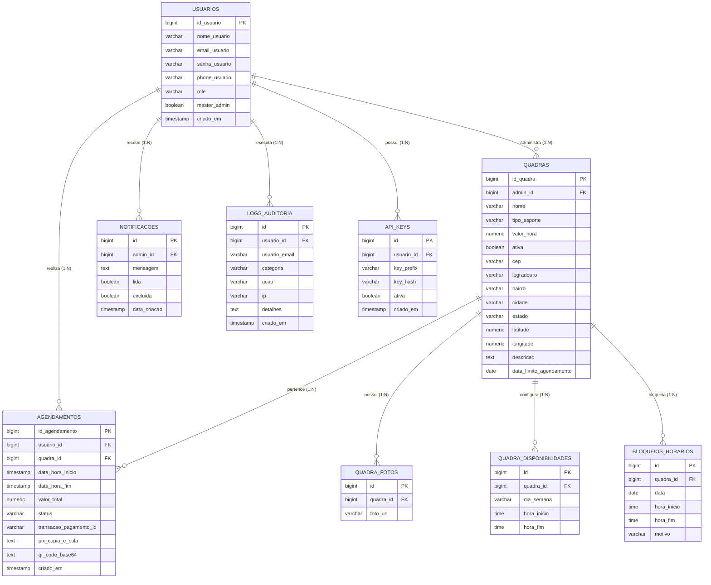

<p align="center">
  
</p>

<h1 align="center">eQuadras - Plataforma de Gestão e Agendamento Esportivo</h1>

<p align="center">
  <strong>Plataforma moderna, resiliente e escalável para locação e gestão de complexos esportivos com grade diária interativa, calendário mensal de ocupação, agendamento concorrente com lock pessimista, pagamento instantâneo via Pix, notificações SSE em tempo real, auditoria e controle de API Keys.</strong>
</p>

<p align="center">
  <a href="https://github.com/GuilhermeAizzaSano/eQuadras/actions/workflows/ci.yml"></a>
  <a href="https://equadras.app"></a>
  
  
  
  
  
  
  
  
  
</p>

<p align="center">
  <strong>Ambiente Online Oficial:</strong> <a href="https://equadras.app">https://equadras.app</a><br/>
  <strong>Swagger UI (Produção):</strong> <a href="https://equadras.app/swagger-ui/index.html">https://equadras.app/swagger-ui/index.html</a><br/>
  <strong>OpenAPI Spec (JSON):</strong> <a href="https://equadras.app/v3/api-docs">https://equadras.app/v3/api-docs</a><br/>
  <strong>Guia Técnico da API:</strong> <a href="docs/api/API_DOCUMENTATION.md">docs/api/API_DOCUMENTATION.md</a>
</p>

---

## Sumário
1. [Visão Geral](#visão-geral)
2. [Acesso em Produção](#acesso-em-produção)
3. [Destaques da Plataforma](#destaques-da-plataforma)
4. [Módulos da Plataforma](#módulos-da-plataforma)
   - [4.1 Portal do Atleta (Cliente)](#41-portal-do-atleta-cliente)
   - [4.2 Painel Administrativo (Gestor de Quadras)](#42-painel-administrativo-gestor-de-quadras)
   - [4.3 Painel Master Admin](#43-painel-master-admin)
5. [Arquitetura do Sistema e Código](#arquitetura-do-sistema-e-código)
6. [Stack Tecnológica Completa](#stack-tecnológica-completa)
7. [Modelo de Dados e Diagrama ER](#modelo-de-dados-e-diagrama-er)
8. [Segurança, Concorrência e Resiliência](#segurança-concorrência-e-resiliência)
9. [Integrações Externas](#integrações-externas)
10. [Infraestrutura e Pipeline CI/CD](#infraestrutura-e-pipeline-cicd)
11. [Guia de Instalação e Execução Local](#guia-de-instalação-e-execução-local)
12. [Endpoints Principais da API](#endpoints-principais-da-api)
13. [Variáveis de Ambiente](#variáveis-de-ambiente)
14. [Licença e Autoria](#licença-e-autoria)

---

## Visão Geral

O **eQuadras** é uma solução completa desenvolvida para transformar a locação e administração de complexos esportivos (Futebol Society, Beach Tennis, Tênis, Futsal, Vôlei e Basquete). 

A plataforma resolve os principais gargalos operacionais: conflitos de reservas simultâneas, falta de visibilidade da agenda diária, cobranças manuais e atrasos em confirmações. Ela oferece agendamento atômico em tempo real com **Lock Pessimista no banco de dados**, emissão de **Pix dinâmico** integrado ao Mercado Pago, painel visual com **Grade Diária em Timeline**, **Calendário Mensal de Ocupação**, **Server-Sent Events (SSE)** para notificações instantâneas, **Trilha de Auditoria** e **Gerenciamento Seguro de API Keys**.

---

## Acesso em Produção

O sistema está implantado e disponível publicamente sob o domínio oficial com terminação segura TLS/HTTPS:

- **Aplicação Web:** [https://equadras.app](https://equadras.app)
- **Documentação Swagger UI:** [https://equadras.app/swagger-ui/index.html](https://equadras.app/swagger-ui/index.html)
- **OpenAPI 3 Spec (JSON):** [https://equadras.app/v3/api-docs](https://equadras.app/v3/api-docs)

---

## Destaques da Plataforma

1. **Busca Geográfica Otimizada no SQL com Raio Restrito:**
   - Busca por geolocalização e proximidade filtrada, ordenada e paginada diretamente a nível de banco de dados (fórmula Haversine via SQL nativo), eliminando carregamentos pesados em memória.
   - Restrição estrita de raio para até **2 km**, assegurando precisão local para praticantes.
   - Listagem paginada (`Pageable`) de 6 em 6 quadras (`/quadras`) e rota `/api/quadras` sem paginação para integrações externas.

2. **Grade Diária Visual (Timeline Grid) com Carregamento em Lote:**
   - Visualização horizontal interativa das 06:00 às 23:00 para todas as quadras.
   - Otimização com batch loading de agendamentos e bloqueios em lote para renderização instantânea sem queries N+1.
   - Identificação cromática de status: **Livre** (verde), **Agendado** (azul), **Bloqueado** (âmbar) e **Passado/Realizado** (cinza).

3. **Calendário Mensal de Ocupação e Agenda do Dia Sob Demanda (`DayAgendaModal`):**
   - Visão mensal com barras diárias de ocupação percentual e status de reservas.
   - Modal com sub-abas organizadas: jogos ativos visíveis de imediato e carregamento sob demanda para jogos realizados e cancelados.

4. **Autenticação Unificada (Sessão Web & API Key com RBAC):**
   - Sessão Web por cookie seguro com atributos `HttpOnly`, `SameSite=Lax` e `Secure=true` (`equadras_session`).
   - Módulo desacoplado `UsuarioAuthService` dedicado à autenticação, sessões e rate limiting contra força bruta.
   - Suporte padronizado a chaves de integração externas (API Key no cabeçalho `X-API-KEY` ou `Authorization: Bearer eq_...`) com hash SHA-256 no banco e suporte a todas as rotas da API respeitando os papéis (`ROLE_CLIENT` e `ROLE_ADMIN`).

5. **Trilha de Auditoria com Eventos de Domínio:**
   - Registro automático e imutável de ações sensíveis (logins, alterações cadastrais, bloqueios, agendamentos e cancelamentos) desacoplado via eventos Spring (`Domain Events`).
   - Painel exclusivo para consulta e métricas no Master Admin.

6. **Central de Notificações em Tempo Real:**
   - Conexão persistente Server-Sent Events (SSE) notificando o administrador instantaneamente após confirmação de pagamentos.
   - Ações de leitura individual, em lote e exclusão rápida.

---

## Módulos da Plataforma

### 4.1 Portal do Atleta (Cliente)
- **Busca por Geolocalização & CEP:** Integração com ViaCEP e OpenStreetMap/Nominatim com cálculo nativo de distância e raio máximo de 2 km.
- **Filtros por Modalidade:** Futebol Society, Beach Tennis, Tênis, Futsal, Vôlei e Basquete.
- **Catálogo Paginado (6 por página):** Visualização de quadras com galeria de fotos, valores/hora, endereço e status de disponibilidade.
- **Alerta de Pagamento Pendente Intuitivo:** Card com contagem regressiva, navegação rápida entre reservas pendentes e atalho instantâneo para pagamento Pix.
- **Seletor de Agendamento Inteligente (`BookingModal`):** Carrossel dos próximos 14 dias calculando horários vagos e respeitando dias fechados e data limite de agendamento da quadra.
- **Seleção de Slots Contíguos:** Seleção de múltiplos horários consecutivos com cálculo automático do valor proporcional.
- **Pagamento Pix em Tempo Real:** Geração instantânea de QR Code base64 e chave Copia e Cola Mercado Pago, com contador regressivo de 15 minutos.
- **Gestão de Reservas:** Painel com reservas ativas paginadas, histórico de partidas realizadas e cancelamento facilitado.

### 4.2 Painel Administrativo (Gestor de Quadras)
- **Dashboard Operacional:** KPIs de faturamento diário/total, taxa de ocupação e barra de próximas partidas nas próximas 4 horas (isolado no `DashboardService`).
- **Alternância Grade Diária / Calendário Mensal:** Controle total dos horários do complexo esportivo em diferentes perspectivas de visualização.
- **Gestão de Quadras:** Cadastro e edição com upload de até 5 fotos por quadra, data limite de agendamento, endereço e grade de horários semanais.
- **Bloqueios de Horários e Dias:** Bloqueio pontual de slots ou dias completos para manutenções, reformas e eventos privados, com cálculo puro em `BloqueioIntervaloCalculator`.
- **Histórico de Agendas por Quadra:** Modal de auditoria rápida das reservas passadas e futuras de cada espaço esportivo.
- **Sino de Notificações:** Notificações em tempo real com contador de não lidas e marcação em lote.

### 4.3 Painel Master Admin
- **Gestão de Usuários:** Cadastro, edição de perfis (`ROLE_CLIENT` e `ROLE_ADMIN`), listagem com suporte a paginação opcional (`?page=...`) e proteção de conta Master.
- **Painel de Auditoria de Logs:** Consulta de eventos operacionais com filtros por usuário, categoria, data e busca de texto.
- **Gerenciamento de API Keys:** Painel para geração, consulta de prefixo e revogação de chaves de integração.

---

## Arquitetura do Sistema e Código

O backend adota o padrão em camadas desacopladas (Clean Architecture / Domain-Driven Design pragmático), com serviços especialistas altamente coesos e sem acoplamento cíclico:

```text
equadras/
├── src/main/java/com/agendamentos/equadras/
│   ├── config/              # Security, CORS, Swagger/OpenAPI, HttpClient gerenciado e Mappers
│   ├── controller/          # Controllers REST (Quadras, Agendamentos, Notificações, Usuários, Auditoria, Pagamentos)
│   ├── dto/                 # DTOs de Entrada e Saída (Jakarta Validation)
│   ├── exception/           # Global Exception Handler (RFC 7807 Problem Details)
│   ├── model/
│   │   ├── entity/          # Entidades JPA (Usuario, Quadra, Agendamento, Notificacao, BloqueioHorario, LogAuditoria, ApiKey)
│   │   ├── enums/           # Role, StatusAgendamento, TipoEsporte, DiaSemana, CategoriaAuditoria
│   │   └── events/          # Eventos de domínio (QuadraAlteradaEvent, BloqueioAlteradoEvent)
│   ├── repository/          # Repositórios Spring Data JPA com queries nativas otimizadas e Lock Pessimista
│   ├── security/            # Filtros JWT, autenticação de API Key, Rate Limiting e anotações customizadas
│   └── service/             # Serviços especializados:
│       ├── AgendaConsultaService.java          # Consultas consolidadas da agenda
│       ├── AgendamentoBotService.java          # Integração para agendamentos via Bot
│       ├── AgendamentoExpiracaoScheduler.java  # Rotina agendada de expiração de Pix
│       ├── AgendamentoLockService.java         # Concorrência e lock pessimista
│       ├── AgendamentoService.java             # Gestão do ciclo de vida das reservas
│       ├── AuditoriaService.java               # Persistência e consulta da trilha de auditoria
│       ├── BloqueioHorarioService.java         # Gestão de bloqueios administrativos
│       ├── BloqueioIntervaloCalculator.java    # Cálculo puro de interseções de horários
│       ├── DashboardService.java               # Métricas e KPIs do dashboard
│       ├── GradeHorariosService.java           # Montagem e validação da grade de horários
│       ├── NotificacaoService.java             # Mensageria e push via SSE
│       ├── PagamentoService.java               # Gateway Mercado Pago com HttpClient resiliente
│       ├── QuadraBuscaService.java             # Motor de busca por proximidade e filtros SQL
│       ├── QuadraFotoService.java              # Armazenamento e consulta de fotos
│       ├── QuadraService.java                  # CRUD e regras de negócio de quadras
│       ├── UsuarioAuthService.java             # Autenticação, rate limit e sessões
│       └── UsuarioService.java                 # CRUD e regras de autorização de usuários
├── frontend/
│   ├── src/
│   │   ├── api/             # Camada de comunicação HTTP desacoplada (apiClient.ts)
│   │   ├── components/      # Componentes organizados por contexto (admin, client, layout, ui)
│   │   ├── contexts/        # AuthContext para sessão e dados do usuário logado
│   │   ├── pages/           # ClientDashboard, AdminDashboard, AuthPage
│   │   ├── types/           # Tipagens TypeScript estritas derivadas dos contratos
│   │   └── utils/           # Formatadores de datas locais, validações e helpers
│   ├── dist/                # Build de produção gerado pelo Vite
│   └── nginx.conf           # Configuração de proxy reverso e SPA fallback
├── .github/workflows/
│   └── ci.yml               # Pipeline automatizado de CI/CD (Testes + Deploy remoto via SSH)
├── restart.ps1              # Script PowerShell para restart e build automatizado local e remoto
└── restart.sh               # Script Bash equivalente para ambientes Linux/macOS
```

---

## Stack Tecnológica Completa

| Camada | Tecnologia | Versão | Destaque de Engenharia |
|---|---|---|---|
| **Linguagem / Runtime** | Java OpenJDK | 21 LTS | Virtual Threads habilitadas para alta concorrência |
| **Framework Backend** | Spring Boot | 3.4.x | Spring Data JPA, Spring Security 6, Spring Validation, Tomcat 11 |
| **Banco de Dados** | PostgreSQL | 17 (Supabase) | Hospedado na região `sa-east-1` (São Paulo) com latência reduzida |
| **Pool de Conexões** | HikariCP | Integrado | Pool resiliente com `open-in-view=false` |
| **Autenticação / Sessão** | JJWT & Secure Cookies | 0.12.x | Cookies HttpOnly `SameSite=Lax` para web e suporte a Bearer token |
| **Chaves de API** | API Keys Opaque | SHA-256 | Prefixadas (`eq_...`), armazenadas com hash e com rate limiting em memória |
| **Tempo Real** | Server-Sent Events (SSE) | HTTP/1.1 | Notificações push sem overhead de polling |
| **Frontend Framework** | React | 18.3.x | Componentes modulares, estado reativo e hooks customizados |
| **Linguagem Frontend**| TypeScript | 5.x | Tipagem estrita ponta a ponta |
| **Estilização** | Tailwind CSS | 3.4.x | Design dark/light mode elegante com suporte de tema |
| **Build Tool** | Vite | 5.4.x | Code-splitting, minificação e build ultrarrápido |
| **Proxy / Servidor Web**| Nginx | 1.24+ | Proxy reverso, gzip, suporte a SSE sem buffer e SSL Let's Encrypt |
| **Edge / DNS / WAF**   | Cloudflare | Managed | Proxy Anycast, proteção DDoS e mitigação de ameaças |
| **Hospedagem em Nuvem** | Oracle Cloud (OCI) | Ubuntu 24.04 | VM Compute gerenciada pelo `systemd` com auto-restart |

---

## Modelo de Dados e Diagrama ER



---

## Segurança, Concorrência e Resiliência

1. **Prevenção de Double Booking via Lock Pessimista:**
   - O método `buscarComLockParaAgendamento` no repositório executa `SELECT ... FOR UPDATE` na linha da quadra durante a validação da janela de agendamento, garantindo atomicidade e evitando conflitos de concorrência.
2. **Segregação Estrita de Sessão Web vs API Key:**
   - Requisições autenticadas pelo navegador utilizam cookie seguro assinado `equadras_session` contendo autoridade `SCOPE_SESSION`.
   - Rotas administrativas de usuários (`/usuarios/**`) exigem estritamente `SCOPE_SESSION`. API Keys externas só conseguem interagir com rotas de negócio permitidas (`/quadras/**`, `/agendamentos/**`, `/pagamentos/**`).
3. **Resiliência do Gateway de Pagamento:**
   - A chamada de criação de Pix no Mercado Pago é realizada com `HttpClient` gerenciado, timeouts explícitos e fora da transação de banco de dados, liberando a conexão de pool enquanto aguarda a resposta do gateway.
   - Suporte a chave de idempotência para evitar cobranças duplicadas.
4. **Limpeza Automática de Pix Expirados:**
   - Job agendado (`@Scheduled`) no `AgendamentoExpiracaoScheduler` roda a cada minuto no Spring Boot e cancela automaticamente reservas pendentes após 15 minutos, liberando os horários instantaneamente.
5. **Rate Limiting em Memória:**
   - Proteção de endpoints de login e regeneração de API Key contra abuso e tentativas de força bruta.

---

## Integrações Externas

- **Mercado Pago Payments API (`v1/payments`):** Emissão de cobranças Pix com QR Code e chave copia-e-cola.
- **ViaCEP API (`viacep.com.br/ws/{cep}/json`):** Busca e preenchimento automático de endereço por CEP.
- **OpenStreetMap / Nominatim API:** Geocodificação de endereços para cálculo de raio de proximidade (até 2 km).
- **Google Maps:** Deep link direto para navegação até o local da quadra.

---

## Infraestrutura e Pipeline CI/CD

### Topologia de Produção
```text
[ Atleta / Navegador ]
        │
        ▼ (HTTPS / TLS 1.3)
[ Cloudflare Edge Proxy ] ─── DNS Anycast, Proteção DDoS, WAF
        │
        ▼ (Proxy Reverso)
[ Oracle Cloud (OCI VM Ubuntu 24.04) ]
        │
        ├── [ Nginx ] ──► SPA React (/frontend/dist)
        │         └──► Backend Spring Boot (127.0.0.1:8080)
        │
        ▼ (SSL / Região sa-east-1)
[ Supabase PostgreSQL 17 ]
```

### Automação de CI/CD (GitHub Actions)
O pipeline (`.github/workflows/ci.yml`) é acionado automaticamente a cada `push` na branch `main`:
1. **Backend CI:** Compilação e execução de testes automatizados com Maven e JDK 21.
2. **Frontend CI:** Instalação limpa (`npm ci`), verificação de tipos TypeScript e build de produção.
3. **Deploy Automatizado (OCI VM via SSH):**
   - Atualização do repositório (`git pull origin main`).
   - Se houver mudanças no backend: compilação com `./mvnw clean package -DskipTests=true` e reinício seguro do serviço `equadras-backend.service`.
   - Se houver mudanças no frontend: rebuild do bundle SPA (`rebuild_frontend.sh`) e recarregamento gracioso do Nginx (`systemctl reload nginx`).

---

## Guia de Instalação e Execução Local

### Pré-requisitos
- **Java 21 JDK**
- **Node.js 20+** e **npm**
- **PostgreSQL 14+** em execução

### 1. Clonar o Repositório
```bash
git clone https://github.com/GuilhermeAizzaSano/eQuadras.git
cd eQuadras
```

### 2. Configurar Variáveis de Ambiente
Copie o template e preencha suas variáveis:
```bash
cp .env.example .env
```

### 3. Executar o Backend
```bash
# Windows
.\mvnw.cmd spring-boot:run

# Linux / macOS
./mvnw spring-boot:run
```
A API estará acessível em `http://localhost:8080`.

### 4. Executar o Frontend
Em outro terminal:
```bash
cd frontend
npm install
npm run dev
```
O frontend estará acessível em `http://localhost:5173`.

---

## Endpoints Principais da API

| Método | Endpoint | Permissão | Descrição |
|---|---|:---:|---|
| `POST` | `/usuarios/login` | Público | Autenticação e emissão de sessão web / token |
| `POST` | `/usuarios/logout` | Público | Encerramento de sessão e invalidação de cookies |
| `GET` | `/usuarios/me` | Autenticado | Dados do perfil autenticado |
| `GET` | `/usuarios` | `ROLE_ADMIN` (Master) | Listagem de usuários do sistema (suporta paginação `?page=...`) |
| `GET` | `/quadras` | Autenticado | Listar quadras completas (suporta paginação `page`, `size` e filtros) |
| `GET` | `/api/quadras` | Autenticado | Listar quadras no formato resumido sem paginação (para bots e terceiros) |
| `POST` | `/quadras` | `ROLE_ADMIN` | Cadastrar nova quadra com grade de horários e fotos |
| `PUT` | `/quadras/{id}` | `ROLE_ADMIN` | Atualizar dados cadastrais e grade da quadra |
| `PATCH`| `/quadras/{id}/status` | `ROLE_ADMIN` | Ativar ou desativar quadra esportiva |
| `POST` | `/quadras/{id}/fotos` | `ROLE_ADMIN` | Upload de até 5 fotos por quadra |
| `GET` | `/quadras/bloqueios` | `ROLE_ADMIN` | Consulta unificada de bloqueios de horários do gestor |
| `POST` | `/quadras/{id}/bloqueios` | `ROLE_ADMIN` | Criar bloqueio de horários ou dia inteiro |
| `GET` | `/agendamentos/dia` | `ROLE_ADMIN` | Grade consolidada de agendamentos para uma data |
| `GET` | `/agendamentos/quadra/{id}/horarios-disponiveis` | Autenticado | Slots disponíveis de uma quadra para a data informada |
| `GET` | `/agendamentos/quadra/{id}` | `ROLE_ADMIN` | Histórico completo de reservas da quadra do admin |
| `POST` | `/agendamentos` | Autenticado | Criar agendamento com lock pessimista e emissão de Pix |
| `POST` | `/agendamentos/bot` | Público (WhatsApp) | Agendamento simplificado sem token para automação WhatsApp |
| `GET` | `/agendamentos` | Autenticado | Listagem de reservas (`?historico=true` para histórico) |
| `PATCH`| `/agendamentos/{id}/cancelar` | Autenticado | Cancelar agendamento ativo |
| `GET` | `/notificacoes/stream` | `ROLE_ADMIN` | Stream de Server-Sent Events (SSE) para notificações em tempo real |
| `GET` | `/notificacoes/admin` | `ROLE_ADMIN` | Histórico paginado de notificações do administrador |
| `PUT` | `/notificacoes/ler-todas` | `ROLE_ADMIN` | Marcar todas as notificações como lidas |
| `GET` | `/admin/auditoria` | `ROLE_ADMIN` (Master) | Trilha de auditoria operacional paginada com filtros |
| `POST` | `/usuarios/api-key/regenerar` | Autenticado | Geração e substituição de API Key pessoal |

---

## Variáveis de Ambiente

Principais parâmetros de configuração (`.env` ou variáveis de ambiente do sistema):

```env
# Banco de Dados PostgreSQL
SPRING_DATASOURCE_URL=jdbc:postgresql://localhost:5432/equadras_db
SPRING_DATASOURCE_USERNAME=seu_usuario
SPRING_DATASOURCE_PASSWORD=sua_senha

# Autenticação JWT (mínimo 32 caracteres)
JWT_SECRET=sua_chave_secreta_super_segura_com_no_minimo_32_caracteres
JWT_EXPIRACAO_MS=28800000

# Mercado Pago (Sandbox ou Produção)
MERCADOPAGO_ACCESS_TOKEN=TEST-...

# Origens Permitidas no CORS
EQUADRAS_CORS_ORIGENS=https://equadras.app,https://www.equadras.app,http://localhost:5173,http://localhost:3000

# Conta Master Admin inicial (opcional)
ADMIN_MASTER_EMAIL=gui@gmail.com
ADMIN_MASTER_PASSWORD=sua_senha_segura
```

---

## Licença e Autoria

Desenvolvido por **[Guilherme Aizza Sano](https://github.com/GuilhermeAizzaSano)**.

Distribuído sob a licença **MIT**. Consulte o arquivo [LICENSE](LICENSE) para mais informações.
