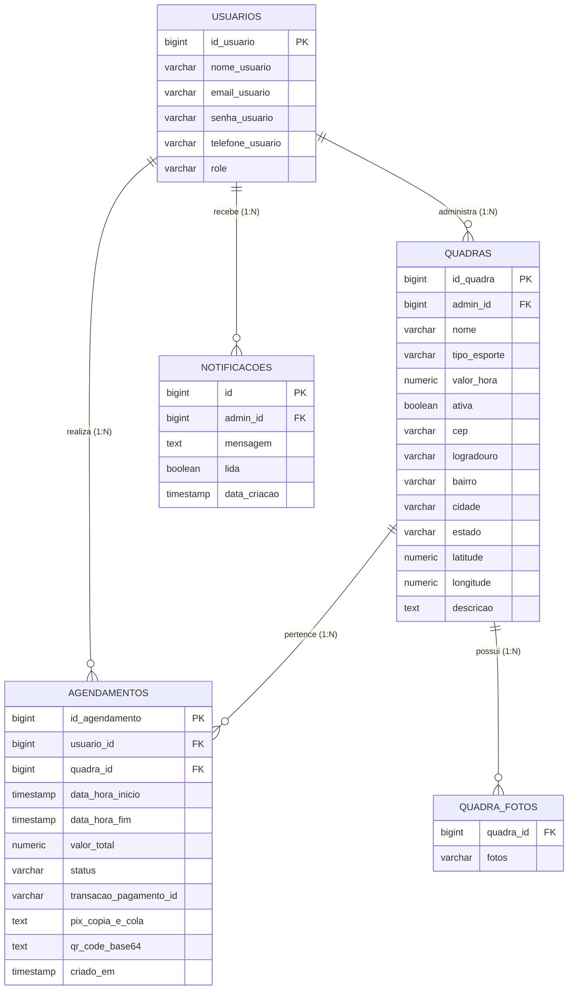

<p align="center">
  
</p>

<h1 align="center">eQuadras - Plataforma de Gestão e Agendamento Esportivo</h1>

<p align="center">
  <strong>Sistema moderno, resiliente e escalável para locação de quadras esportivas com agendamento em tempo real, pagamento instantâneo via Pix e notificações SSE.</strong>
</p>

<p align="center">
  
  
  
  
  
  
  
</p>

---

## 📌 Sumário
1. [Visão Geral](#-visão-geral)
2. [Arquitetura do Sistema](#-arquitetura-do-sistema)
3. [Stack Tecnológica](#-stack-tecnológica)
4. [🌐 Integrações com APIs Externas](#-integrações-com-apis-externas)
5. [Estrutura do Banco de Dados](#-estrutura-do-banco-de-dados)
6. [Destaques de Segurança & Resiliência](#-destaques-de-segurança--resiliência)
7. [Design System & Interface](#-design-system--interface)
8. [Guia de Instalação e Execução](#-guia-de-instalação-e-execução)
9. [Endpoints Principais da API](#-endpoints-principais-da-api)
10. [Variáveis de Ambiente](#-variáveis-de-ambiente)
11. [Licença & Autoria](#-licença--autoria)

---

## 📖 Visão Geral

O **eQuadras** foi desenvolvido para solucionar a burocracia no agendamento e administração de quadras esportivas (Futebol, Beach Tennis, Tênis, Futsal, Vôlei e Basquete). 

A plataforma divide-se em dois portais integrados:
- **Portal do Atleta:** Busca de quadras com geolocalização e raio em KM (via CEP e Nominatim OpenStreetMap), galeria com carrossel de fotos, detalhes da estrutura, modal dedicado para seleção de horários nos próximos 14 dias com prevenção de colisões, geração de Pix copia e cola com QR Code e histórico completo de reservas (Ativas, Realizadas e Canceladas).
- **Painel Administrativo:** Gestão de quadras (CRUD, upload seguro de até 5 fotos por quadra, alternância de status ativo/inativo), métricas financeiras (faturamento total, reservas do dia, histórico geral), calendário mensal interativo, controle da agenda diária e central de notificações em tempo real via **Server-Sent Events (SSE)**.

---

## 🏗 Arquitetura do Sistema

O projeto segue a arquitetura em camadas orientada a domínio (DDD Simplificado / Clean Architecture), desacoplando lógica de negócios, camada de persistência e apresentação:

```text
equadras/
├── src/main/java/com/agendamentos/equadras/
│   ├── config/              # Configurações globais (CORS, Security, Static Resources)
│   ├── controller/          # Endpoints REST e SSE Controllers
│   ├── dto/                 # Data Transfer Objects (Requests e Responses)
│   ├── exception/           # Global Exception Handler (RFC 7807 Problem Details)
│   ├── model/
│   │   ├── entity/          # Entidades JPA (Usuario, Quadra, Agendamento)
│   │   └── enums/           # Enums de domínio (Role, StatusAgendamento, TipoEsporte)
│   ├── repository/         # Interfaces Spring Data JPA
│   └── service/            # Regras de negócio, armazenamento e pagamentos
└── frontend/
    ├── src/
    │   ├── api/             # Camada de comunicação HTTP (Axios / Fetch)
    │   ├── components/      # Componentes visuais atômicos e reutilizáveis
    │   ├── contexts/        # Gerenciamento de estado global (AuthContext)
    │   ├── pages/           # Telas (ClientDashboard, AdminDashboard, AuthPage)
    │   └── types/           # Tipagens estritas TypeScript
```

---

## ⚡ Stack Tecnológica

### Backend
- **Java 21 LTS** com suporte a **Virtual Threads (Project Loom)** ativado para altíssima concorrência com baixo consumo de memória.
- **Spring Boot 3.4.x** (Spring Data JPA, Spring Web MVC, Spring Validation, Spring Security).
- **PostgreSQL 16+** como banco relacional principal.
- **Server-Sent Events (SSE):** Streaming unidirecional para notificações em tempo real.
- **RFC 7807 (Problem Details):** Tratamento padronizado de exceções HTTP.

### Frontend
- **React 18** com **TypeScript 5**.
- **Vite 5:** Ferramenta de build ultrarrápida.
- **Tailwind CSS 3:** Estilização utilitária com Design System escuro (`#09090b` Zinc-950) e foco em acessibilidade WCAG AA.
- **Lucide React:** Conjunto de ícones vetoriais modernos.

---

## 🌐 Integrações com APIs Externas

O eQuadras conecta-se a serviços e APIs públicas e privadas para automatizar geolocalização, pagamentos instantâneos e enriquecimento de dados:

| API / Serviço | Tipo / Protocolo | Finalidade no Sistema | Implementação |
|---|---|---|---|
| **Mercado Pago Payments API** | REST / HTTPS (`v1/payments`) | Criação de cobranças Pix oficiais com QR Code base64 e código Copia e Cola, idempotência via UUID e suporte a fallback dinâmico para ambiente de testes. | [`PagamentoService.java`](src/main/java/com/agendamentos/equadras/service/PagamentoService.java) |
| **ViaCEP API** | REST / JSON (`viacep.com.br/ws/{cep}/json/`) | Autocomplete de endereço completo (Logradouro, Bairro, Cidade, UF) a partir do CEP no cadastro de quadras e no filtro de busca do atleta. | [`QuadraService.java`](src/main/java/com/agendamentos/equadras/service/QuadraService.java) |
| **OpenStreetMap / Nominatim API** | REST / JSON (`nominatim.openstreetmap.org/search`) | Geocodificação reversa para conversão de endereços em coordenadas geográficas (Latitude e Longitude), viabilizando o cálculo de raio e distância (Fórmula de Haversine). | [`QuadraService.java`](src/main/java/com/agendamentos/equadras/service/QuadraService.java) |
| **Google Maps Navigation** | Deep Linking / Web (`google.com/maps/search/?api=1&query=...`) | Redirecionamento e abertura direta da rota e localização da quadra a partir das coordenadas registradas no modal de detalhes da quadra. | [`CourtDetailsModal.tsx`](frontend/src/components/ui/CourtDetailsModal.tsx) |

---

## 🗄 Estrutura do Banco de Dados



---

## 🔒 Destaques de Segurança & Resiliência

1. **Prevenção de Colisão e Double Booking:**
   - Validação transacional estrita impedindo marcações concorrentes no mesmo intervalo de tempo.
2. **Armazenamento de Arquivos Seguro ([`FileStorageService.java`](src/main/java/com/agendamentos/equadras/service/FileStorageService.java)):**
   - Validação estrita de tipo MIME (`image/jpeg`, `image/png`, `image/webp`), limite de 5MB por arquivo e nomes UUID aleatórios impedindo Path Traversal.
   - Limite máximo de 5 fotos por quadra.
3. **Fluxo de Confirmação em Duas Etapas:**
   - Ações destrutivas (exclusão, inativação, cancelamento de agendamento) exigem confirmação explícita via modal estilizado.
4. **Resiliência a Quedas e Recombinações Pix:**
   - Expiração visual e lógica de transações pendentes de Pix com temporizador de 15 minutos.

---

## 🎨 Design System & Interface

- **Tema:** Dark mode com paleta base Zinc (`#09090b` Zinc-950, `#18181b` Zinc-900, `#27272a` Zinc-800) e destaque em esmeralda vibrante (`#34d399` Emerald-400).
- **Responsividade:** 100% otimizado para dispositivos móveis, tablets e telas ultrawide.
- **Microinterações:** Efeitos de hover nos cards, carrossel de fotos intuitivo com controles de toque e teclado, modais com transições suaves e indicador de loading global esmaecido.

---

## 🚀 Guia de Instalação e Execução

### Pré-requisitos
- **Java 21 JDK** instalado
- **Node.js 18+** e **npm** instalados
- **PostgreSQL 14+** rodando localmente (ou via Docker)

---

### 1. Clonar o Repositório
```bash
git clone https://github.com/GuilhermeAizzaSano/eQuadras.git
cd eQuadras
```

---

### 2. Configurar o Banco de Dados PostgreSQL
Crie um banco de dados vazio:
```sql
CREATE DATABASE equadras_db;
```

---

### 3. Executar o Backend (Spring Boot)
```bash
# Windows
./mvnw.cmd spring-boot:run

# Linux / macOS
./mvnw spring-boot:run
```
O servidor backend iniciará na porta **`8080`** (`http://localhost:8080`).

---

### 4. Executar o Frontend (React + Vite)
Abra outro terminal:
```bash
cd frontend
npm install
npm run dev
```
O frontend estará acessível em: **`http://localhost:3000`** (ou `http://localhost:5173`).

---

## 📡 Endpoints Principais da API

| Método | Rota | Descrição |
|---|---|---|
| `POST` | `/auth/login` | Autenticação de usuário e retorno de credenciais |
| `POST` | `/auth/register` | Registro de novos atletas ou administradores |
| `GET` | `/quadras` | Listagem de quadras (filtros por esporte, coordenadas e raio em km) |
| `POST` | `/quadras` | Cadastro de nova quadra esportiva (Admin) |
| `PUT` | `/quadras/{id}` | Atualização de dados da quadra |
| `POST` | `/quadras/{id}/fotos` | Upload multipart/form-data de fotos (máx. 5 fotos) |
| `DELETE` | `/quadras/{id}/fotos` | Exclusão de foto da quadra |
| `GET` | `/agendamentos/horarios` | Consulta de horários e disponibilidade por quadra e data |
| `POST` | `/agendamentos` | Criação de agendamento e geração do Pix |
| `PUT` | `/agendamentos/{id}/pagar` | Confirmação de pagamento Pix (webhook/simulação) |
| `PUT` | `/agendamentos/{id}/cancelar`| Cancelamento de reserva |
| `GET` | `/notificacoes/stream/{adminId}` | Stream SSE para notificações em tempo real |

---

## ⚙️ Variáveis de Ambiente

Copie o arquivo `.env.example` para configurar suas credenciais locais:

```env
SPRING_DATASOURCE_URL=jdbc:postgresql://localhost:5432/equadras_db
SPRING_DATASOURCE_USERNAME=postgres
SPRING_DATASOURCE_PASSWORD=postgres
MERCADOPAGO_ACCESS_TOKEN=
```

---

## 👨‍💻 Autoria & Licença

Desenvolvido por **[Guilherme Aizza Sano](https://github.com/GuilhermeAizzaSano)**.

Distribuído sob a licença MIT. Consulte `LICENSE` para mais detalhes.
