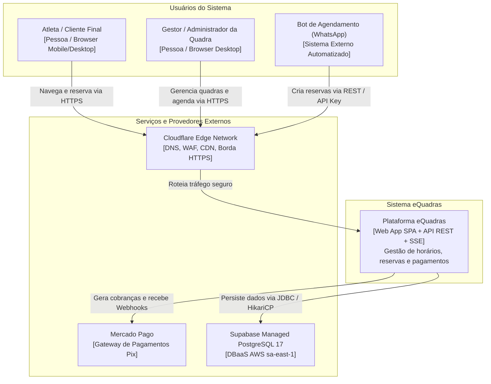
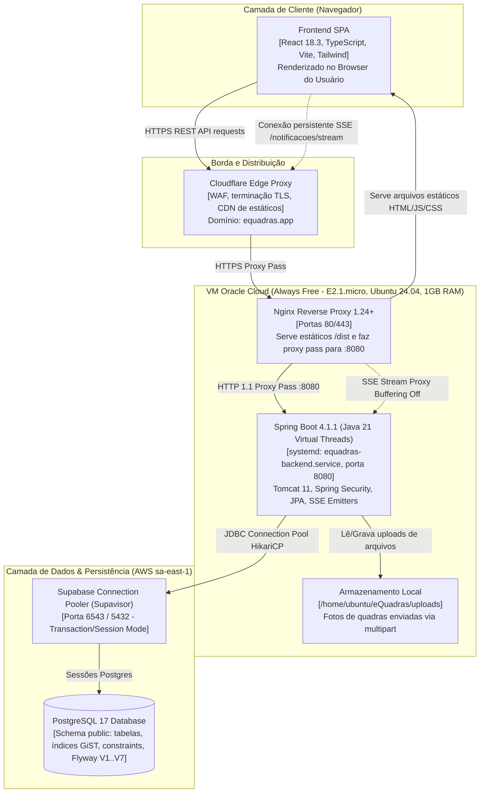

# 00 — Contexto do Sistema, Drivers e Inventário (Fase 0)

> **Documento base compartilhado para os subagentes A1..A7 da Auditoria de Arquitetura.**  
> Todos os subagentes devem ler este documento como fonte única de verdade sobre o ambiente, drivers de qualidade e topologia do sistema.

---

## 1. Escopo & Acessos Externos Confirmados

- **Repositório:** Monorepo unificado contendo Backend Java/Spring Boot na raiz e Frontend React/Vite na pasta `frontend/`.
- **Acesso à VM (OCI):** Liberado para comandos de leitura via SSH (`137.131.163.62`, usuário `ubuntu`, chave `$HOME\.ssh\oracle_key.key`).
- **Acesso ao Supabase (PostgreSQL 17):** Liberado para consultas SQL de leitura (`pg_tables`, grants, `pg_stat_activity`, etc.).
- **Acesso à Cloudflare:** Liberado para verificações externas de leitura HTTP/TLS e inspeção de borda.
- **Regra de Execução:** Modo estritamente **somente leitura**. Nenhum subagente edita código, dados, configurações ou infraestrutura.

---

## 2. Drivers de Qualidade e Metas de Arquitetura

Levantados e confirmados na Fase 0:

| Driver | Métrica / Meta | Tolerância / Observação |
|---|---|---|
| **Usuários Concorrentes** | 50 a 100 usuários simultâneos no pico | Cenário inicial/universitário de uso |
| **Conexões SSE Simultâneas** | 20 a 50 clientes conectados | Conexões persistentes para atualização de agenda/notificações |
| **Latência (p95)** | < 500 ms nas rotas transacionais críticas | Rotas de listagem de horários, reserva e pagamento |
| **Disponibilidade** | 99,0% de disponibilidade global | Sistema suporta pequenos períodos de manutenção noturna |
| **Tolerância a Downtime em Deploy** | ≤ 1 a 2 minutos | Deploy manual/CI atual reinicia o serviço systemd |
| **RPO (Recovery Point Objective)** | ≤ 24 horas | Tolerância máxima de perda de dados correspondente a 1 ciclo de backup diário |
| **RTO (Recovery Time Objective)** | ≤ 2 horas | Tempo máximo para restauro de serviço em nova VM / banco |
| **Shape da VM (OCI)** | `VM.Standard.E2.1.micro` (Always Free) | 1 OCPU AMD EPYC, 1.0 GB RAM, Ubuntu 24.04 LTS |
| **Plano Supabase** | Free Tier (AWS `sa-east-1` São Paulo) | Limite padrão de conexões diretas (max ~60 conexões pooler/diretas), pausamento por inatividade |

---

## 3. Inventário Efetivo do Sistema

### 3.1. Versões Efetivas de Software

> [!IMPORTANT]
> A declaração histórica do README citava Spring Boot 3.4 e Java 21. No entanto, a resolução efetiva do Maven (`pom.xml`) e do npm (`frontend/package.json`) constatou as seguintes versões reais:

#### Backend (JVM / Spring Boot)
- **Java Runtime / Compiler:** Java 21 (`release 21`, JDK 25 compatível)
- **Spring Boot Parent:** `4.1.1` (Linha moderna do Spring Boot 4)
- **Spring Framework:** `7.0.9`
- **Spring Security:** `7.1.1`
- **Spring Data JPA / Hibernate:** `Hibernate ORM 7.4.5.Final` / `Jakarta Persistence 3.2.0`
- **Connection Pooler:** `HikariCP 7.0.2`
- **PostgreSQL JDBC Driver:** `42.7.13`
- **Flyway Database Migrations:** `12.4.0` (`flyway-database-postgresql`)
- **Documentação de API:** `springdoc-openapi 2.8.5` (Swagger UI 5.18.3)
- **JWT (Stateless Auth):** `io.jsonwebtoken:jjwt-api:0.12.6` (JJWT Jackson / Impl)
- **Embedded Web Server:** `Apache Tomcat 11.0.24` (com `spring.threads.virtual.enabled=true`)
- **JSON Processing:** Jackson Databind `2.21.5` / `3.1.5`

#### Frontend (SPA)
- **React:** `18.3.1` (`react-dom 18.3.1`)
- **TypeScript:** `5.9.3` (`@types/react 18.3.31`, `@types/node 22.20.1`)
- **Build Tool / Bundler:** `Vite 5.4.21` (`@vitejs/plugin-react 4.7.0`)
- **Styling:** `Tailwind CSS 3.4.19` + `PostCSS 8.5.26` + `Autoprefixer 10.5.4` + `clsx 2.1.1` + `tailwind-merge 3.7.0`
- **Ícones & QR Code:** `lucide-react 0.436.0`, `qrcode.react 4.2.0`
- **Cliente OpenAPI:** `openapi-typescript 7.13.0`
- **Testes Unitários:** `vitest 1.6.1`, `@testing-library/react 16.3.3`, `@testing-library/jest-dom 6.9.1`, `jsdom 24.1.3`

---

### 3.2. Estrutura de Pacotes & Módulos

#### Backend (`src/main/java/com/agendamentos/equadras/`)
```
com.agendamentos.equadras/
├── EquadrasApplication.java
├── config/                  # WebMvcConfig, SecurityConfig, OpenApiConfig, StorageConfig, AsyncConfig
├── controller/              # Agendamento, Auditoria, BloqueioHorario, Notificacao, Pagamento, Quadra, Usuario
├── dto/
│   ├── request/             # DTOs de entrada validados com Jakarta Validation
│   └── response/            # DTOs de saída desacoplados de entidades
├── event/                   # Eventos de domínio da aplicação (Spring Events)
├── exception/               # GlobalExceptionHandler (@RestControllerAdvice), RFC 7807 ProblemDetail
├── listener/                # AgendamentoAuditoriaListener, AgendamentoNotificacaoListener (@EventListener)
├── model/
│   ├── entity/              # Entidades JPA (Usuario, Quadra, Agendamento, Notificacao, Bloqueio, Auditoria)
│   └── enums/               # StatusAgendamento, PapelUsuario, TipoQuadra, etc.
├── repository/              # Spring Data JPA Repositories (queries derivadas e JPQL/nativas)
├── security/                # JwtService, JwtAuthenticationFilter, ApiKeyFilter, RateLimiting
├── service/                 # Regras transacionais de negócio (AgendamentoService, QuadraService, etc.)
└── util/                    # Utilitários de timezone, formatação, data flexível
```

#### Frontend (`frontend/src/`)
```
frontend/src/
├── api/                     # Cliente HTTP (client.ts), rotas de API, hooks de query
├── assets/                  # Imagens e ícones estáticos
├── components/
│   ├── admin/               # Telas e modais administrativos (gestão de quadras, bloqueios, auditoria)
│   ├── client/              # Telas do cliente (agendamento, pagamento Pix, calendário)
│   ├── layout/              # Header, Navbar, Sidebar, Footer, Wrapper
│   └── ui/                  # Componentes reutilizáveis (Button, Modal, Card, Badge, Alert)
├── contexts/                # AuthContext (token JWT, sessão), ThemeContext
├── hooks/                   # useAuth, useSSE, useQuadras, useAgendamentos
├── lib/                     # Configurações de libs e instâncias auxiliares
├── pages/                   # Rotas de página SPA (Home, Login, AdminDashboard, AgendamentoPage)
├── types/                   # Contratos de tipagem (api-schema.d.ts, domain models)
└── utils/                   # dateUtils.ts, currencyUtils.ts, validationUtils.ts
```

---

### 3.3. Endpoints HTTP Mapeados

Todos os endpoints utilizam mapeamento duplo opcional (ex: `/agendamentos` e `/api/agendamentos`):

| Controlador | Método | Rota | Descrição |
|---|---|---|---|
| `AgendamentoController` | `POST` | `/agendamentos` | Criar agendamento (cliente autenticado) |
| `AgendamentoController` | `GET` | `/agendamentos` | Listar agendamentos do usuário ou todos (admin) |
| `AgendamentoController` | `GET` | `/agendamentos/{id}` | Detalhes de um agendamento |
| `AgendamentoController` | `PATCH` | `/agendamentos/{id}/cancelar` | Cancelar agendamento |
| `AgendamentoController` | `GET` | `/agendamentos/quadra/{quadraId}` | Buscar agendamentos de uma quadra específica |
| `AgendamentoController` | `GET` | `/agendamentos/quadra/{quadraId}/horarios-disponiveis` | Horários livres por quadra e data |
| `AgendamentoController` | `GET` | `/agendamentos/dia` | Resumo de agendamentos por data |
| `AgendamentoController` | `POST` | `/agendamentos/bot` | Criação de agendamentos via Bot WhatsApp (API Key/Secret) |
| `AgendamentoController` | `GET` | `/agendamentos/horarios-disponiveis` | Grade global de disponibilidade |
| `AuditoriaController` | `GET` | `/admin/auditoria` | Listagem paginada de logs de auditoria |
| `AuditoriaController` | `GET` | `/admin/auditoria/estatisticas` | Métricas operacionais de auditoria |
| `BloqueioHorarioController` | `POST` | `/quadras/{id}/bloqueios` | Bloquear horário de quadra (manutenção/evento) |
| `BloqueioHorarioController` | `GET` | `/quadras/bloqueios` | Listar todos os bloqueios ativos |
| `BloqueioHorarioController` | `GET` | `/quadras/{id}/bloqueios` | Listar bloqueios de uma quadra |
| `BloqueioHorarioController` | `DELETE` | `/quadras/{quadraId}/bloqueios/{bloqueioId}` | Remover bloqueio específico |
| `BloqueioHorarioController` | `POST` | `/quadras/{quadraId}/desbloquear` | Desbloquear faixa |
| `NotificacaoController` | `GET` | `/notificacoes/stream` | **Stream SSE (Server-Sent Events)** de notificações em tempo real |
| `NotificacaoController` | `GET` | `/notificacoes/admin` | Listar notificações do administrador |
| `NotificacaoController` | `PUT` | `/notificacoes/{id}/ler` | Marcar notificação individual como lida |
| `NotificacaoController` | `PUT` | `/notificacoes/ler-todas` | Marcar todas as notificações como lidas |
| `NotificacaoController` | `DELETE` | `/notificacoes/todas` | Limpar notificações |
| `PagamentoController` | `POST` | `/pagamentos/{agendamentoId}/simular-aprovacao` | Simulação dev/sandbox de pagamento Pix |
| `PagamentoController` | `GET` | `/pagamentos/{agendamentoId}/status` | Consultar status de liquidação do Pix |
| `PagamentoController` | `POST` | `/pagamentos/webhook` | Webhook público para notificações do Mercado Pago |
| `QuadraController` | `POST` | `/quadras` | Cadastrar quadra (Admin) |
| `QuadraController` | `GET` | `/quadras` | Listagem pública de quadras com paginação e filtros |
| `QuadraController` | `GET` | `/quadras/{id}` | Buscar quadra por ID |
| `QuadraController` | `PUT` | `/quadras/{id}` | Atualizar dados da quadra |
| `QuadraController` | `DELETE` | `/quadras/{id}` | Exclusão de quadra |
| `QuadraController` | `PATCH` | `/quadras/{id}/status` | Alternar ativa/inativa |
| `QuadraController` | `POST` | `/quadras/{id}/fotos` | Upload multipart de imagem da quadra |
| `QuadraController` | `DELETE` | `/quadras/{id}/fotos` | Remover foto da quadra |
| `QuadraController` | `GET` | `/quadras/{id}/fotos`, `/quadras/fotos` | Download/visualização de foto |
| `UsuarioController` | `POST` | `/usuarios/login` | Autenticação de usuário e emissão de JWT |
| `UsuarioController` | `POST` | `/usuarios/logout` | Encerramento de sessão |
| `UsuarioController` | `GET` | `/usuarios/me` | Dados do usuário autenticado |
| `UsuarioController` | `GET` | `/usuarios/api-key` | Consultar API Key do usuário |
| `UsuarioController` | `POST` | `/usuarios/api-key/regenerar` | Gerar nova API Key |
| `UsuarioController` | `DELETE` | `/usuarios/api-key` | Revogar API Key |
| `UsuarioController` | `POST` | `/usuarios` | Registro de novo usuário cliente |
| `UsuarioController` | `PUT` | `/usuarios/{id}` | Atualização de perfil |
| `UsuarioController` | `DELETE` | `/usuarios/{id}` | Desativação de conta |
| `UsuarioController` | `GET` | `/usuarios` | Listagem de usuários (Admin) |
| `UsuarioController` | `PATCH` | `/usuarios/minha-senha` | Alteração de credencial |
| `UsuarioController` | `GET` | `/usuarios/{id}` | Obter usuário por ID |

---

### 3.4. Componentes Assíncronos, Jobs & Filtros

- **Jobs Agendados (`@Scheduled`):**
  1. `AgendamentoService.expirarAgendamentosPendentes()`: Roda a cada 60.000 ms (`fixedRate = 60000`). Cancela agendamentos com status `PENDENTE` há mais de 15 minutos e publica `AgendamentosExpiradosCanceladosEvent`.
  2. `ApiKeyRateLimiter.limparRegistrosExpirados()`: Limpa janelas de rate limiting de API Keys em memória a cada 60 s.
  3. `LoginRateLimiter.limparTentativasExpiradas()`: Limpa tentativas de login falhas a cada 60 s.
- **Filtros HTTP (`OncePerRequestFilter`):**
  1. `CorrelationIdFilter`: Injeta e propaga `X-Correlation-Id` no MDC do SLF4J para rastreabilidade de requisições.
  2. `JwtAuthenticationFilter`: Extrai cabeçalho `Authorization: Bearer <token>`, valida assinatura e expiração JWT, injeta `SecurityContext`.
  3. `RateLimitFilter`: Intercepta rotas e aplica limite de taxa por IP/rota sensível.
  4. `ClientHeaderFilter`: Sanitiza ou propaga cabeçalhos de identificação de cliente.
- **Listeners de Eventos (`@EventListener`):**
  1. `AgendamentoAuditoriaListener`: Registra logs de auditoria em banco a cada transição de status ou agendamentos cancelados.
  2. `AgendamentoNotificacaoListener`: Dispara eventos de notificação em tempo real via `NotificacaoService` (conectado aos emitters SSE).

---

### 3.5. Documentação & Histórico de Arquitetura Existente

Planos e especificações versionados no repositório:
- `docs/superpowers/plans/2026-09-18-otimizacao-supabase.md`: Tunings de HikariCP e batching Hibernate para pooler Supabase.
- `docs/superpowers/plans/2026-09-21-paginacao-quadras.md`: Paginação no banco e refinamento de listagem.
- `docs/superpowers/plans/2026-09-22-arquitetura-enxuta-e-desacoplamento.md`: Desacoplamento de controllers, DTOs e eventos.
- `docs/superpowers/specs/2026-09-22-arquitetura-enxuta-e-desacoplamento-design.md`: Spec de arquitetura limpa em camadas.
- `docs/superpowers/plans/2026-09-23-remediacao-sql-e-logica-negocio.md`: Remediação contra double-booking com GiST no Postgres, compensação de Pix, tratamento de IDOR.

---

## 4. Diagramas C4

### 4.1. C4 Nível 1 — Diagrama de Contexto do Sistema



---

### 4.2. C4 Nível 2 — Diagrama de Containers e Topologia de Execução



---

## 5. Próximos Passos (Transição para Fase 1)

Com este contexto oficial validado e publicado:
- **A1:** Estrutura e Camadas do Backend (`01-backend-structure.md`)
- **A2:** Dados e Persistência (`02-data-persistence.md`)
- **A3:** Concorrência e Tempo Real (`03-concurrency-realtime.md`)
- **A4:** Segurança (`04-security.md`)
- **A5:** Infra e Operação (`05-infra-operations.md`)
- **A6:** Arquitetura do Frontend (`06-frontend-architecture.md`)
- **A7:** Qualidade, Testes e Entrega (`07-quality-delivery.md`)
