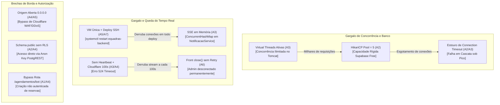
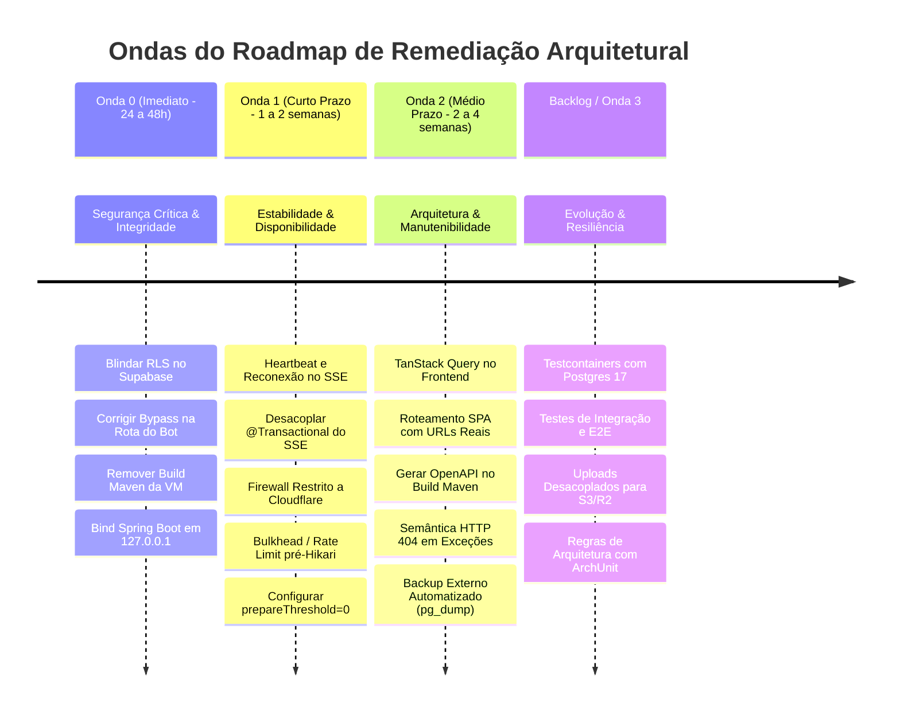

# 20 — Síntese Transversal, Riscos Correlacionados e Roadmap (Fase 3)

> **Documento de consolidação estratégica da Auditoria de Arquitetura do eQuadras.**  
> Este documento cruza os achados de todos os 7 domínios (A1..A7) aprovados na Fase 2, analisa cenários sistêmicos de atributos de qualidade frente aos drivers da Fase 0 e define o roadmap prioritário de remediação estruturado em ondas.

---

## 1. Sumário Executivo do Diagnóstico

A auditoria completa de arquitetura (front, back, dados, tempo real, segurança e infraestrutura) mapeou a plataforma eQuadras em sua topologia real de produção (OCI Always Free + Supabase AWS São Paulo + Cloudflare + React SPA).

### Distribuição Consolidada de Achados

| Domínio | 🔴 Crítico | 🟠 Alto | 🟡 Médio | 🔵 Baixo | Total | Status da Revisão |
|---|:---:|:---:|:---:|:---:|:---:|:---:|
| **A1 — Estrutura Backend** | 0 | 6 | 5 | 4 | **15** | ✅ Aprovado (R1) |
| **A2 — Dados e Persistência** | 2 | 2 | 3 | 5 | **12** | ✅ Aprovado (R2) |
| **A3 — Concorrência e Tempo Real** | 1 | 3 | 5 | 4 | **13** | ✅ Aprovado (R3) |
| **A4 — Segurança** | 1 | 1 | 2 | 1 | **5** | ✅ Aprovado (R4) |
| **A5 — Infra e Operação** | 3 | 3 | 4 | 2 | **12** | ✅ Aprovado (R5) |
| **A6 — Arquitetura Frontend** | 1 | 3 | 4 | 2 | **10** | ✅ Aprovado (R6) |
| **A7 — Qualidade e Entrega** | 0 | 2 | 2 | 1 | **5** | ✅ Aprovado (R7) |
| **Total do Sistema** | **7** | **20** | **25** | **19** | **72** | **100% Auditado** |

### Conclusão Executiva

O sistema eQuadras apresenta uma arquitetura com boas escolhas modernas (Java 21 Virtual Threads, Spring Boot modular, Flyway migrations e UI Tailwind responsiva). Entretanto, **a coexistência de decisões isoladas entre camadas gerou nós críticos de vulnerabilidade e instabilidade operacional**. 

Os riscos mais severos concentram-se em:
1. **Exposição de dados via API PostgREST do Supabase** (schema `public` sem RLS conectado via role superuser `postgres`).
2. **Gargalo e risco de OOM severo na VM de produção** decorrente da compilação Maven durante o deploy automatizado via SSH em máquina com apenas 1 GB de RAM.
3. **Instabilidade do canal de tempo real (SSE)**, que não possui *heartbeat*, sofre quedas contínuas por timeout da Cloudflare (erro 524) e tem sua auto-reconexão abortada pelo cliente React no primeiro erro.
4. **Bypass de autenticação no endpoint público do bot** (`/agendamentos/bot`), que permite criação de reservas sem credenciais caso a variável de ambiente não esteja preenchida.
5. **Gargalo assimétrico de concorrência**: Virtual Threads sem limite de contenção disputando um pool HikariCP de apenas 5 conexões com o banco de dados.

---

## 2. Riscos Correlacionados e Efeitos Cruzados (Task 3.1)

O valor da análise transversal reside nas falhas que emergem do acoplamento entre camadas que parecem saudáveis isoladamente:

### 2.1. Virtual Threads (A3) × HikariCP (A2) × Limites do Supabase (A2)
- **Mecanismo:** A ativação de Virtual Threads no Spring Boot (`spring.threads.virtual.enabled=true`) remove o limite tradicional de threads concorrentes do Tomcat. Sob um pico moderado (ex: 80 usuários navegando e reservando simultaneamente), dezenas de Virtual Threads alcançam os métodos `@Transactional` dos serviços ao mesmo tempo.
- **Consequência:** Como o HikariCP está restrito a `maximum-pool-size=5` (para não exceder o limite do plano Free do Supabase / Supavisor), todas as threads concorrentes além da 5ª entram em espera bloqueante por conexão JDBC. Ao atingir `connection-timeout=20000ms`, a aplicação dispara exceções em massa (`SQLTransientConnectionException`), degradando o p95 e gerando erros 500 para os usuários.
- **Achados Cruzados:** `[CONC-02]`, `[A2-08]`, `[INFRA-08]`.

### 2.2. SSE em Memória (A3) × Instância Única (A5) × Deploy via SSH (A5/A7)
- **Mecanismo:** O gerenciamento de conexões `SseEmitter` é puramente em memória (`ConcurrentHashMap` em `NotificacaoService`). A infraestrutura opera em uma única VM sem clusterização ou pub/sub externo.
- **Consequência:** A cada deploy acionado pelo GitHub Actions (`.github/workflows/ci.yml`), o comando `systemctl restart equadras-backend` mata o processo JVM, liquidando instantaneamente todas as conexões SSE ativas de administradores e clientes.
- **Achados Cruzados:** `[CONC-04]`, `[INFRA-01]`, `[A7-03]`.

### 2.3. Ausência de Heartbeat SSE (A3) × Timeout da Cloudflare (A4) × Erro no Frontend (A6)
- **Mecanismo:** A Cloudflare encerra requisições HTTP pendentes sem transmissão de dados após aproximadamente 100 segundos (gerando erro HTTP 524). O backend não envia comentários periódicos (`: ping\n\n`) nem eventos de keepalive. No frontend, o hook `useAdminNotifications.ts` trata o evento `onerror` executando `eventSource.close()` e anulando a referência sem qualquer lógica de reconexão ou temporizador com backoff.
- **Consequência:** Toda conexão SSE de um administrador é terminada pela Cloudflare aos 100 segundos e **nunca mais se reconecta**, deixando o gestor com o sino de notificações e a agenda congelados sem perceber.
- **Achados Cruzados:** `[CONC-05]`, `[SEC-04]`, `[F-A6-01]`, `[INFRA-04]`.

### 2.4. Exposição PostgREST no Supabase (A2) × Spring Security (A4)
- **Mecanismo:** O Supabase disponibiliza automaticamente endpoints REST (PostgREST) sobre todas as tabelas criadas no schema `public`. A migração Flyway V1 criou tabelas (`usuarios`, `quadras`, `agendamentos`) sem habilitar RLS (`ALTER TABLE ... ENABLE ROW LEVEL SECURITY`). O backend conecta-se utilizando o usuário superuser `postgres`.
- **Consequência:** Se a chave anônima pública (`anon key`) do Supabase for descoberta (ou estiver presente em qualquer bundle/histórico), agentes externos podem consultar e alterar cadastros de usuários e reservas diretamente via API REST do Supabase, contornando 100% das regras de autenticação JWT, BCrypt, RBAC e validações do Spring Security.
- **Achados Cruzados:** `[A2-01]`, `[SEC-01]`.

### 2.5. Exposição Direta da Origem na VM (A4) × WAF da Cloudflare (A4/A5)
- **Mecanismo:** A VM OCI possui endereço IP público fixo (`137.131.163.62`). A inspeção de firewall (`sudo iptables -S`) constatou que as portas 80 e 443 aceitam conexões de `0.0.0.0/0`.
- **Consequência:** Um atacante pode conectar-se diretamente ao IP público da VM passando o cabeçalho `Host: equadras.app`, ignorando completamente os filtros de WAF, mitigação de DDoS e rate limiting da Cloudflare. Além disso, a porta 8080 da aplicação Java está aberta em `0.0.0.0:8080` em vez de `127.0.0.1:8080`.
- **Achados Cruzados:** `[SEC-01]`, `[INFRA-03]`, `[A1-04]`.

### 2.6. Deploy Compilando Maven na VM (A5/A7) × Capacidade de Memória (1GB RAM)
- **Mecanismo:** O workflow `.github/workflows/ci.yml:97` conecta via SSH na VM de produção e executa `./mvnw clean package -DskipTests=true`. A compilação do Maven com Spring Boot consome picos de 600 MB a 1 GB de RAM.
- **Consequência:** Como a VM possui apenas 954 MiB de RAM total e já aloca ~320 MB para a JVM em execução e ~340 MB em swap, a compilação do Maven satura a memória do host e aciona o **Linux OOM Killer**, que frequentemente mata o processo do Tomcat/Spring Boot ou trava o sistema operacional durante o deploy.
- **Achados Cruzados:** `[INFRA-08]`, `[INFRA-10]`, `[A7-03]`.

### 2.7. Divergência OpenAPI (A1) × Tipos TypeScript (A6) × Testes de Contrato (A7)
- **Mecanismo:** O arquivo `openapi.yaml` utilizado para gerar os tipos no frontend (`npm run generate:api`) está desatualizado em relação às anotações reais dos DTOs e entidades do Spring Boot. O projeto não possui testes automatizados de contrato nem geração de schema no build do Maven.
- **Consequência:** O time de frontend precisou introduzir dezenas de `Omit<Schemas[...]>` e type assertions manuais em `frontend/src/types/index.ts`. Qualquer alteração de campos na API quebra a interface do usuário em produção sem que o CI detecte erro de compilação.
- **Achados Cruzados:** `[A1-07]`, `[A1-11]`, `[F-A6-05]`, `[A7-05]`.

---

## 3. Avaliação de Cenários de Atributos de Qualidade (Task 3.2)

Comparativo entre os **Drivers de Qualidade acordados na Fase 0** e a capacidade real demonstrada pela arquitetura atual:

| Atributo | Estímulo / Cenário | Resposta Esperada (Meta Fase 0) | Comportamento Real Diagnosticado | Atende? | Achados Chave |
|---|---|---|---|:---:|---|
| **Disponibilidade** | Reinicialização da VM ou falha do processo JVM | Serviço restabelecido em ≤ 1 a 2 minutos; reconexão automática dos clientes | Systemd reinicia o serviço Java em ~30s (`Restart=on-failure`), mas conexões SSE morrem e frontend não reconecta. Falha de hardware na VM exige recriação manual (RTO > 2-4h). | ⚠️ **Parcial** | `INFRA-01`, `INFRA-02`, `F-A6-01` |
| **Desempenho** | Pico de 100 usuários simultâneos com 50 conexões SSE ativas | Latência p95 ≤ 500 ms em rotas críticas; sem recusa de conexões | Virtual Threads avançam sem barreira; HikariCP esgota suas 5 conexões; fila atinge timeout (20s) e devolve HTTP 500. Retenção de conexões em SSE `@Transactional` agrava contenção. | ❌ **Não** | `CONC-01`, `CONC-02`, `A2-08` |
| **Segurança** | Requisição forjada alterando ID de agendamento/usuário (IDOR) | Resposta imediata com HTTP 403 / 404; sem vazamento de dados | Endpoints transacionais validam dono repassando `usuarioLogado.id()` ao service. Contudo, rota `/agendamentos/bot` aceita chamadas sem secret se env var for vazia. | ⚠️ **Parcial** | `SEC-01`, `A1-06`, `A2-01` |
| **Segurança (Borda)** | Varredura de portas e ataque DDoS direto contra IP da VM | Bloqueio na borda pela Cloudflare; origem oculta e protegida | Origem aberta em `0.0.0.0:80/443/8080`. Tráfego direto alcança o Nginx e o Spring Boot, contornando Cloudflare WAF e rate limits. | ❌ **Não** | `SEC-01`, `INFRA-03` |
| **Recuperabilidade** | Corrupção total do banco de dados no Supabase | Restauração de dados com perda ≤ 24h (RPO) e tempo ≤ 2h (RTO) | Dependência exclusiva de rotinas padrão do Supabase Free. Não há backup agendado fora do Supabase (`pg_dump`) nem procedimento testado de restore. | ❌ **Não** | `INFRA-06`, `INFRA-07` |
| **Modificabilidade** | Adição de campo obrigatório em DTO do backend | Frontend acusa erro de build no CI em caso de incompatibilidade | CI do frontend roda `npm run build` contra tipos locais estáticos. `openapi.yaml` desacoplado do código Java; divergências passam silenciosas para produção. | ❌ **Não** | `A1-11`, `F-A6-05`, `A7-05` |

---

## 4. Decisões Arquiteturais Retroativas (Task 3.3)

Foram consolidados e formalizados 5 Architecture Decision Records (ADRs) retroativos no diretório `docs/audit/adr/`:

1. [docs/audit/adr/001-adocao-sse-para-tempo-real.md](file:///c:/Users/Gui%20-%20PC/Desktop/faculdade/java_projeto/eQuadras/docs/audit/adr/001-adocao-sse-para-tempo-real.md): Adoção de Server-Sent Events (SSE) em substituição a WebSockets; documenta riscos de SPOF em memória, ausência de heartbeat e retenção de conexões JDBC.
2. [docs/audit/adr/002-autenticacao-jwt-stateless.md](file:///c:/Users/Gui%20-%20PC/Desktop/faculdade/java_projeto/eQuadras/docs/audit/adr/002-autenticacao-jwt-stateless.md): Autenticação stateless via JJWT; documenta riscos de fallbacks hardcoded, divergência de TTLs e falta de refresh token seguro em cookies HttpOnly.
3. [docs/audit/adr/003-banco-gerenciado-supabase-sa-east-1.md](file:///c:/Users/Gui%20-%20PC/Desktop/faculdade/java_projeto/eQuadras/docs/audit/adr/003-banco-gerenciado-supabase-sa-east-1.md): Uso do Supabase PostgreSQL 17 gerenciado; documenta vulnerabilidade de PostgREST aberto sem RLS, `prepareThreshold=0` e limite do pooler.
4. [docs/audit/adr/004-virtual-threads-java-21.md](file:///c:/Users/Gui%20-%20PC/Desktop/faculdade/java_projeto/eQuadras/docs/audit/adr/004-virtual-threads-java-21.md): Habilitação de Java 21 Virtual Threads no Tomcat 11; documenta contenção assimétrica com o HikariCP e riscos de pinning por `synchronized`.
5. [docs/audit/adr/005-topologia-instancia-unica-oci-always-free.md](file:///c:/Users/Gui%20-%20PC/Desktop/faculdade/java_projeto/eQuadras/docs/audit/adr/005-topologia-instancia-unica-oci-always-free.md): Topologia de servidor único em VM E2.1.micro; documenta o SPOF da infraestrutura, gargalo de memória de 1 GB e acoplamento de builds locais.

---

## 5. Roadmap Priorizado de Remediação (Task 3.4)

O plano de ação para sanar as vulnerabilidades e fragilidades identificadas divide-se em 4 ondas estratégicas de remediação, balanceando severidade, risco sistêmico e esforço de implementação.

---

### Onda 0 — Segurança Crítica & Estabilidade Imediata (24 a 48 horas)
*Foco: Eliminar brechas graves de segurança, perda de dados e risco de queda imediata do servidor.*

| Item | Ação Proposta | Domínio | Esforço | Risco se não corrigido | Pré-requisitos |
|---|---|:---:|:---:|---|---|
| **O0-1** | **Habilitar RLS no Schema Public do Supabase** Criar migração Flyway `V8` aplicando `ALTER TABLE ... ENABLE ROW LEVEL SECURITY` em todas as tabelas do `public` e revogar grants excessivos da role `anon`. | A2, A4 | **P** | Acesso irrestrito a todos os dados do banco por qualquer agente de posse da chave anônima do Supabase via PostgREST. | Nenhum (aplicação conecta como `postgres`, bypassando RLS). |
| **O0-2** | **Corrigir Bypass de Autenticação na Rota do Bot** Alterar validação em `AgendamentoController.java:108` para rejeitar a requisição com HTTP 401 caso o segredo do bot não esteja configurado ou não coincida. | A1, A4 | **P** | Criação pública e indiscriminada de agendamentos falsos via `/agendamentos/bot` em ambientes sem secret configurado. | Nenhum. |
| **O0-3** | **Desacoplar Compilação Maven da VM de Produção** Atualizar `.github/workflows/ci.yml` para compilar o JAR nos runners do GitHub (`ubuntu-latest`) e transferir apenas o artefato pronto (`target/equadras.jar`) via SCP/SSH para a VM. | A5, A7 | **M** | OOM Killer matando o processo da aplicação durante deploys devido ao consumo excessivo de RAM pelo Maven. | Configurar action de upload de artefato no GitHub. |
| **O0-4** | **Restringir Bind do Spring Boot a Loopback** Alterar `server.address=127.0.0.1` em `application.properties` para impedir que a porta 8080 responda publicamente na interface de rede da VM. | A4, A5 | **P** | Acesso direto ao Tomcat sem passar pelos filtros e headers do Nginx. | Garantir que o Nginx aponte para `http://127.0.0.1:8080`. |
| **O0-5** | **Remover Fallbacks de Segredos em application.properties** Eliminar valores default inseguros (`123456`, `jwt.secret`, `bot.api-secret`); forçar fail-fast na inicialização se as variáveis de ambiente obrigatórias não existirem. | A1, A4 | **P** | Subida da aplicação vulnerável em caso de erro na injeção do `EnvironmentFile`. | Ajustar `/etc/default/equadras-backend` na VM. |

---

### Onda 1 — Disponibilidade, Resiliência e Concorrência (1 a 2 semanas)
*Foco: Estabilizar o canal de tempo real, proteger o banco contra sobrecarga e blindar a borda.*

| Item | Ação Proposta | Domínio | Esforço | Risco se não corrigido | Pré-requisitos |
|---|---|:---:|:---:|---|---|
| **O1-1** | **Implementar Heartbeat Periódico no SSE** Adicionar `@Scheduled(fixedRate = 25000)` em `NotificacaoService` enviando evento de comentário SSE (`: ping\n\n`) a todos os emissores ativos. | A3, A4 | **P** | Encerramento automático de todas as conexões SSE pela Cloudflare aos 100 segundos (erro 524). | Nenhum. |
| **O1-2** | **Reconexão com Backoff Exponencial no Frontend** Refatorar `useAdminNotifications.ts` para não invocar `close()` definitivo em `onerror`, implementando tentativas de reconexão gradual com backoff. | A6 | **P** | Administradores desconectados permanentemente das notificações em tempo real após qualquer oscilação de rede. | O1-1 concluído. |
| **O1-3** | **Desacoplar `@Transactional` do Envio de SSE** Remover anotação `@Transactional` de `NotificacaoService.enviarNotificacao` ou isolar a persistência do disparo de eventos via Spring Events (`@TransactionalEventListener`). | A2, A3 | **P** | Retenção prolongada de conexões JDBC do pool durante I/O de rede com emissores SSE. | Nenhum. |
| **O1-4** | **Restringir Firewall da VM Apenas para IPs da Cloudflare** Configurar `iptables` / `nftables` na VM OCI para aceitar tráfego nas portas 80/443 exclusivamente dos blocos CIDR oficiais da Cloudflare. | A4, A5 | **M** | Bypass de WAF e ataques diretos contra a origem via IP público `137.131.163.62`. | Testar lista de IPs atualizada da Cloudflare. |
| **O1-5** | **Configurar `prepareThreshold=0` na JDBC URL** Adicionar parâmetro `?prepareThreshold=0` na string de conexão JDBC com o Supabase Transaction Mode. | A2 | **P** | Falhas aleatórias de prepared statements reutilizados através do pooler Supavisor. | Nenhum. |
| **O1-6** | **Bulkhead / Semáforo de Controle Concorrente pré-Hikari** Configurar semáforo (`Semaphore` ou bucket de concorrência) limitando o número de requisições simultâneas que avançam para transações de banco a no máximo 15-20. | A3 | **M** | Virtual Threads esgotando o HikariCP (max 5) e gerando cascatas de timeout (HTTP 500) sob pico de acessos. | Validação com testes de carga. |
| **O1-7** | **Configurar `real_ip` no Nginx** Adicionar diretivas `set_real_ip_from` e `real_ip_header CF-Connecting-IP` no Nginx para restaurar o IP real dos clientes nos logs e no rate limiter do Spring Boot. | A4, A5 | **P** | Rate limiter penalizando todos os usuários como se fossem o mesmo IP da Cloudflare. | O1-4 implementado. |

---

### Onda 2 — Manutenibilidade, Frontend & Governança de Contrato (2 a 4 semanas)
*Foco: Reduzir dívida técnica, aprimorar a UX da SPA e sincronizar contratos de API.*

| Item | Ação Proposta | Domínio | Esforço | Benefício Arquitetural |
|---|---|:---:|:---:|---|
| **O2-1** | **Adoção de TanStack Query no Frontend** Substituir `useState`/`useEffect` imperativos em `ClientDashboard` e `AdminDashboard` por queries e mutações com cache automático e refetch em background. | A6 | **M** | Elimina mais de 400 linhas de código boilerplate; garante deduplicação de requisições e cache robusto. |
| **O2-2** | **Roteamento SPA com `react-router-dom`** Implementar roteador baseado em URL com suporte a deep linking, botão voltar do browser e lazy loading de páginas pesadas (`React.lazy`). | A6 | **M** | Suporte a compartilhamento de links de quadras e redução do bundle inicial de carregamento da aplicação. |
| **O2-3** | **Pipeline Automatizado de Geração OpenAPI -> TypeScript** Integrar plugin Maven para exportar `openapi.json` na compilação e rodar `openapi-typescript` no CI para sincronização contínua de tipos. | A1, A6, A7 | **M** | Extingue o drift de contratos entre backend e frontend, eliminando casts manuais `Omit`. |
| **O2-4** | **Unificação Semântica de Exceções REST** Criar `ResourceNotFoundException` mapeada para HTTP 404 RFC 7807 no `GlobalExceptionHandler`, ajustando os serviços para não lançarem HTTP 400 para registros inexistentes. | A1 | **P** | Alinha a API pública aos padrões RESTful e simplifica o tratamento de erros no frontend. |
| **O2-5** | **Rotina Automatizada de Backup Externo (`pg_dump`)** Criar script cron na VM ou GitHub Action agendada para executar `pg_dump` diário das tabelas do eQuadras e enviar snapshot criptografado para storage externo seguro. | A5 | **M** | Assegura cumprimento estrito do RPO de 24h e RTO ≤ 2h independente de suspensões no Supabase Free. |

---

### Backlog / Onda 3 — Evolução Contínua & Resiliência Avançada
*Foco: Elevar a maturidade de engenharia e preparar o sistema para escala comercial.*

1. **Testcontainers com PostgreSQL 17 (`A7`):** Substituir banco H2 nos testes de integração por containers reais com extensões `btree_gist` e semântica estrita de concorrência.
2. **Testes de Arquitetura com ArchUnit (`A1`, `A7`):** Adicionar testes unitários de arquitetura validando direções proibidas de dependências (`Controller -> Repository`).
3. **Desacoplamento de Armazenamento de Arquivos (`A1`, `A5`):** Migrar upload de fotos de quadras do disco local da VM para bucket compatível com S3 (Cloudflare R2 ou AWS S3).
4. **Pub/Sub para SSE Horizontal (`A3`):** Implementar driver de mensagens com PostgreSQL `LISTEN/NOTIFY` para viabilizar múltiplos nós de backend mantendo conexões SSE sincronizadas.
