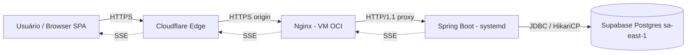

# Auditoria de Arquitetura — Plano de Execução

> **For agentic workers:** REQUIRED SUB-SKILL: Use `superpowers:subagent-driven-development` (recommended) or `superpowers:executing-plans` to implement this plan task-by-task. Fase 1 usa `superpowers:dispatching-parallel-agents`. Steps use checkbox (`- [ ]`) syntax for tracking.

**Local sugerido:** `docs/superpowers/plans/2026-09-23-architecture-audit.md`

**Objetivo:** produzir um diagnóstico de arquitetura do sistema completo (front, back, dados, tempo real, segurança e infraestrutura), com achados baseados em evidência, riscos correlacionados entre camadas e um roadmap priorizado de remediação.

**Natureza da tarefa:** **auditoria somente leitura.** Nenhum agente altera código, configuração ou dados. A saída é documentação em `docs/audit/`. Correções viram planos separados (Fase 4).

**Stack:** Java 21 (Virtual Threads) · Spring Boot 3.4 (JPA, Security 6, Validation, Tomcat) · PostgreSQL 17 no Supabase (sa-east-1) · HikariCP · JJWT 0.12 (HMAC-SHA256) · SSE · React 18.3 + TS 5 + Vite 5.4 + Tailwind 3.4 · Nginx 1.24+ · Cloudflare · OCI Always Free (Ubuntu 24.04, systemd)

**Execução recomendada:** *Subagent-driven*. Os domínios da Fase 1 são independentes e cada um exige leitura profunda de uma área específica. Contexto limpo por domínio evita contaminação entre análises, e a revisão em dois estágios filtra achados sem evidência.

---

## Regras para todos os agentes

1. **Somente leitura.** Proibido editar código, config, banco, VM, Cloudflare ou Supabase.
2. **Produção:** apenas os comandos de leitura listados neste plano. Qualquer outro comando contra produção exige confirmação humana explícita. Em modo não interativo (headless/CI), **abortar e reportar** em vez de executar.
3. **Segredos:** nunca copiar secrets, tokens, senhas, connection strings ou chaves para relatórios, nem para o log da sessão. Mascarar como `***` e registrar apenas *onde* estão e *como* são carregados.
4. **Evidência obrigatória** (`superpowers:verification-before-completion`): cada achado cita `arquivo:linha`, a saída de um comando ou a consulta executada. Achado sem evidência é marcado como **hipótese**, nunca como fato.
5. **Causa raiz** (`superpowers:systematic-debugging`): em comportamento suspeito, investigar até a causa em vez de listar sintomas.
6. **Escopo:** cada subagente fica no seu domínio. Achados de outro domínio vão para a seção "Sinais para outros domínios" do relatório, sem aprofundar.
7. **Workspace isolado** (`superpowers:using-git-worktrees`): a auditoria roda em branch próprio (`audit/architecture-2026-09`). Os únicos arquivos criados ficam em `docs/audit/`.

---

## Estrutura de saída

```
docs/audit/
├── 00-context.md              # Fase 0: inventário, C4, drivers de qualidade
├── 01-backend-structure.md    # A1
├── 02-data-persistence.md     # A2
├── 03-concurrency-realtime.md # A3
├── 04-security.md             # A4
├── 05-infra-operations.md     # A5
├── 06-frontend-architecture.md# A6
├── 07-quality-delivery.md     # A7
├── 10-review-log.md           # Fase 2: resultado das revisões
├── 20-synthesis.md            # Fase 3: riscos cruzados, cenários, roadmap
├── adr/                       # ADRs retroativos propostos (Fase 3)
└── frontend-audit-checklist.md# checklist já existente (entrada do A6)
```

### Formato padrão de achado (todos os relatórios)

```md
### [ID] [SEV] Título curto
- **Domínio:** A1..A7
- **Tipo:** Fato | Hipótese
- **Local/Evidência:** `caminho/arquivo:linha` · saída de comando · consulta
- **Problema:** o que está errado.
- **Impacto:** atributo de qualidade afetado (disponibilidade, segurança, desempenho, custo, manutenibilidade) e cenário concreto.
- **Recomendação:** mudança mínima proposta.
- **Esforço:** P | M | G
- **Relacionados:** IDs de achados de outros domínios (preenchido na Fase 3)
```

**Severidade:** 🔴 Crítico (brecha de segurança, perda de dados, indisponibilidade provável) · 🟠 Alto · 🟡 Médio · 🔵 Baixo

**Esqueleto de cada relatório de domínio:**

```md
# AX — <Domínio>
## Escopo coberto
## Itens do checklist: ✅ conforme · ⚠️ parcial · ❌ não conforme · ➖ não se aplica · ❓ não verificável (motivo)
## Achados
## Sinais para outros domínios
## O que não pôde ser verificado e por quê
```

---

## Fase 0 — Contexto (agente principal)

> Skill: `superpowers:brainstorming` para fechar escopo e drivers com o humano antes de disparar os subagentes.

### Task 0.1 — Fechar escopo e drivers de qualidade

- [ ] Confirmar com o humano: repositórios (front e back juntos ou separados), acesso à VM (sim/não), acesso ao Supabase (SQL read-only sim/não), acesso ao Cloudflare (leitura sim/não)
- [ ] Levantar os **drivers de qualidade** com números, mesmo que aproximados:
  - usuários simultâneos esperados e pico
  - conexões SSE simultâneas esperadas
  - latência aceitável (p95) das rotas principais
  - disponibilidade esperada e tolerância a downtime em deploy
  - RPO/RTO aceitáveis (quanto dado pode ser perdido, em quanto tempo precisa voltar)
  - plano do Supabase (Free/Pro) e shape da VM OCI (A1 Ampere ou E2.1.micro)
- [ ] Registrar em `00-context.md`, seção "Drivers"

**Critério de pronto:** drivers com valor ou marcados explicitamente como "desconhecido".

### Task 0.2 — Inventário

- [ ] Árvore de módulos e pacotes do backend e estrutura de pastas do front
- [ ] Versões efetivas (não as declaradas no README):

```bash
# Backend
./mvnw -q help:evaluate -Dexpression=project.parent.version -DforceStdout 2>/dev/null || ./gradlew -q dependencies --configuration runtimeClasspath | head -50
./mvnw -q dependency:tree -DoutputFile=/tmp/deps.txt 2>/dev/null || ./gradlew -q dependencies > /tmp/deps.txt
# Frontend
npm ls --depth=0
```

- [ ] Endpoints expostos (via springdoc, se existir `/v3/api-docs`, ou busca por `@RequestMapping|@GetMapping|@PostMapping|@PutMapping|@DeleteMapping|@PatchMapping`)
- [ ] Jobs agendados, listeners, filtros e interceptors (`@Scheduled`, `@EventListener`, `OncePerRequestFilter`, `HandlerInterceptor`)
- [ ] ADRs e documentação de arquitetura existentes

### Task 0.3 — Diagramas C4 (nível 1 e 2)

- [ ] **Contexto:** usuários, sistema e sistemas externos (Supabase, Cloudflare, Let's Encrypt, integrações)
- [ ] **Containers:** browser/SPA → Cloudflare → Nginx → Spring Boot (systemd) → Supabase Postgres, incluindo o canal SSE
- [ ] Registrar em Mermaid dentro de `00-context.md`



### Task 0.4 — Preparar e disparar a Fase 1

- [ ] Criar o worktree e a pasta `docs/audit/`
- [ ] Copiar `frontend-audit-checklist.md` para `docs/audit/`
- [ ] Disparar A1–A7 em paralelo com o template do Apêndice A, cada um recebendo `00-context.md` como contexto compartilhado

**Critério de pronto da Fase 0:** `00-context.md` com drivers, inventário e C4, revisado pelo humano.

---

## Fase 1 — Análise paralela por domínio

> Skill: `superpowers:dispatching-parallel-agents`. Domínios independentes, sem estado compartilhado.

| Agente | Domínio | Modelo sugerido | Precisa de acesso externo |
|---|---|---|---|
| A1 | Estrutura e camadas do backend | intermediário | não |
| A2 | Dados e persistência | **mais capaz** | SQL read-only no Supabase (opcional) |
| A3 | Concorrência e tempo real | **mais capaz** | não (VM opcional) |
| A4 | Segurança | **mais capaz** | Cloudflare leitura (opcional) |
| A5 | Infra e operação | intermediário | **VM (leitura)** |
| A6 | Arquitetura do frontend | intermediário | não |
| A7 | Qualidade, testes e entrega | econômico | não |

---

### Task A1 — Estrutura e camadas do backend

**Saída:** `docs/audit/01-backend-structure.md`

**Checklist**

- [ ] Organização por feature ou por camada? Consistente em todo o código?
- [ ] Direção das dependências: `controller → service → repository`, sem ciclos e sem controller acessando repository diretamente
- [ ] Controllers finos: sem regra de negócio, sem `@Transactional`, sem manipulação de entidade
- [ ] **Entidades JPA nunca expostas na API:** DTOs de entrada e saída separados, mapeamento explícito (MapStruct ou manual)
- [ ] Modelo de domínio: regras nas entidades ou serviços "deus" com toda a lógica? Duplicação de regra entre serviços
- [ ] Validação: Bean Validation nos DTOs de entrada (`@Valid`) e regras de negócio no service
- [ ] Tratamento de erro central (`@RestControllerAdvice`) com formato único (ProblemDetail / RFC 7807) e sem stack trace na resposta
- [ ] Configuração: profiles (`dev`/`prod`), `@ConfigurationProperties` tipado, nada hardcoded, segredos via env
- [ ] Contrato público documentado (springdoc) e versionamento de API definido
- [ ] Código morto, classes utilitárias genéricas demais (`Utils`, `Helper`) e acoplamento a detalhes de framework no domínio

**Comandos**

```bash
# Controllers acessando repository diretamente
grep -rln "@RestController" src/main/java | xargs grep -l "Repository"

# Entidades vazando em assinaturas de controller
grep -rn -A3 "@\(Get\|Post\|Put\|Patch\|Delete\)Mapping" src/main/java | grep -E "ResponseEntity<\w+>|public \w+ " | grep -vE "Dto|DTO|Response|Request|Void|String"

# @Transactional fora da camada de serviço
grep -rn "@Transactional" src/main/java | grep -viE "service"

# Tamanho das classes (candidatas a "deus")
find src/main/java -name "*.java" -exec wc -l {} + | sort -rn | head -20

# Ciclos de pacote (jdeps)
./mvnw -q package -DskipTests && jdeps -verbose:package -filter:none target/*.jar | head -100
```

**Proposta de guarda (registrar como recomendação, não implementar):** teste ArchUnit fixando as regras de camada.

```java
@AnalyzeClasses(packages = "com.empresa.app")
class ArchitectureTest {
  @ArchTest
  static final ArchRule layers = layeredArchitecture().consideringAllDependencies()
      .layer("Controller").definedBy("..controller..")
      .layer("Service").definedBy("..service..")
      .layer("Repository").definedBy("..repository..")
      .whereLayer("Controller").mayNotBeAccessedByAnyLayer()
      .whereLayer("Service").mayOnlyBeAccessedByLayers("Controller")
      .whereLayer("Repository").mayOnlyBeAccessedByLayers("Service");
}
```

---

### Task A2 — Dados e persistência

**Saída:** `docs/audit/02-data-persistence.md`

**Checklist — Schema e migrações**

- [ ] 🔴 Migrações versionadas (Flyway/Liquibase). `spring.jpa.hibernate.ddl-auto` em `update`/`create` em produção é crítico
- [ ] Constraints no banco (NOT NULL, FK, UNIQUE, CHECK) espelhando as regras de negócio, não apenas na aplicação
- [ ] Tipos adequados: dinheiro em `numeric` (nunca `float`/`double`), datas com fuso (`timestamptz`) e política de fuso definida (UTC no banco)
- [ ] Índices justificados pelas consultas reais (FKs, filtros, ordenações). Índices ausentes e redundantes
- [ ] Estratégia de soft delete, auditoria (`created_at`, `updated_by`) e concorrência otimista (`@Version`) onde há edição concorrente

**Checklist — JPA / Hibernate**

- [ ] N+1: associações `LAZY` por padrão; uso de `JOIN FETCH`, `@EntityGraph` ou projeções nas listagens
- [ ] `FetchType.EAGER` em coleções
- [ ] `open-in-view=false` confirmado (declarado na stack) e sem `LazyInitializationException` contornada com gambiarra
- [ ] Paginação no banco (`Pageable`), nunca `findAll()` seguido de filtro em memória
- [ ] Fronteiras de transação: `@Transactional` no service, `readOnly = true` em leituras, sem self-invocation (chamada interna que ignora o proxy)
- [ ] Escritas multi-etapa atômicas
- [ ] SQL nativo parametrizado (sem concatenação)

**Checklist — Conexão com o Supabase**

- [ ] Qual endpoint é usado? Conexão direta, pooler em **session mode** ou pooler em **transaction mode**
- [ ] Em transaction mode: `prepareThreshold=0` na URL JDBC (prepared statements do driver quebram com esse modo)
- [ ] Conexão direta do Supabase exige IPv6 por padrão. Confirmar que a VM OCI consegue alcançá-la ou que o pooler está em uso
- [ ] `maximumPoolSize` do Hikari compatível com o limite de conexões do plano do Supabase (somando todas as instâncias e ferramentas)
- [ ] `connectionTimeout`, `maxLifetime` menor que o timeout do servidor/pooler, `leakDetectionThreshold` definido (declarado na stack) e `keepaliveTime`
- [ ] Latência real VM (OCI sa-saopaulo-1) → Supabase (sa-east-1): medir, não assumir os < 15 ms

**Checklist — Exposição do Supabase (crítico)**

- [ ] 🔴 O Supabase expõe por padrão uma API REST (PostgREST) sobre o schema `public`. Se as tabelas da aplicação estão em `public`, com **RLS desabilitado** e grants para `anon`/`authenticated`, os dados podem ser acessados diretamente com a anon key, **sem passar pelo Spring Security**
- [ ] A aplicação usa algum SDK do Supabase no front? Se usar, a anon key está no bundle e a RLS precisa estar correta
- [ ] Usuário de banco da aplicação com privilégio mínimo (não `postgres`/superuser)

**Consultas (read-only, com confirmação humana)**

```sql
-- RLS por tabela no schema public
select schemaname, tablename, rowsecurity
from pg_tables where schemaname = 'public' order by tablename;

-- Privilégios concedidos aos papéis da API do Supabase
select grantee, table_name, string_agg(privilege_type, ', ') as privs
from information_schema.role_table_grants
where grantee in ('anon', 'authenticated') and table_schema = 'public'
group by grantee, table_name order by table_name;

-- Conexões atuais e limite
select state, count(*) from pg_stat_activity group by state;
show max_connections;

-- Consultas mais caras (se pg_stat_statements estiver habilitado)
select calls, round(mean_exec_time::numeric, 2) as mean_ms, left(query, 120) as query
from pg_stat_statements order by total_exec_time desc limit 20;

-- Índices nunca usados
select relname as table, indexrelname as index, idx_scan
from pg_stat_user_indexes where idx_scan = 0 order by relname;
```

**Comandos no código**

```bash
grep -rnE "ddl-auto|open-in-view|hikari|prepareThreshold|jdbc:postgresql" src/main/resources/
grep -rn "FetchType.EAGER" src/main/java
grep -rnE "findAll\(\)" src/main/java
grep -rnE "createNativeQuery|@Query\(.*nativeQuery" src/main/java
grep -rnE "\"(SELECT|UPDATE|DELETE|INSERT).*\" *\+" src/main/java   # concatenação de SQL
```

---

### Task A3 — Concorrência e tempo real

**Saída:** `docs/audit/03-concurrency-realtime.md`

**Checklist — Virtual Threads**

- [ ] `spring.threads.virtual.enabled=true` confirmado e onde se aplica (Tomcat, `@Async`, scheduler)
- [ ] 🟠 **Pinning:** no Java 21, blocos `synchronized` com I/O dentro prendem a virtual thread à carrier thread. Mapear `synchronized` no código próprio e em libs críticas; preferir `ReentrantLock`
- [ ] 🟠 **Pool como gargalo:** virtual threads eliminam o limite natural de concorrência do Tomcat. Com Hikari pequeno, milhares de requisições esperam conexão e estouram `connectionTimeout`. Existe limite de concorrência (semáforo, rate limit) antes do acesso ao banco?
- [ ] Uso de `ThreadLocal` pesado (cache por thread perde o sentido com milhões de threads)
- [ ] Chamadas externas com timeout definido (RestClient/WebClient/HttpClient)

**Checklist — SSE**

- [ ] Onde fica o registro de `SseEmitter`? 🟠 Registro em memória prende o sistema a **uma única instância**: escalar horizontalmente exige pub/sub (Postgres `LISTEN/NOTIFY`, Redis)
- [ ] Remoção do emitter em `onCompletion`, `onTimeout` e `onError` (vazamento de memória e de conexões)
- [ ] Timeout do emitter definido explicitamente
- [ ] 🟠 **Heartbeat:** o proxy da Cloudflare encerra requisições sem tráfego por cerca de 100 s (erro 524). Há envio periódico (comentário `:` ou evento `ping`) em intervalo menor?
- [ ] Nginx: `proxy_buffering off`, `proxy_cache off`, `proxy_read_timeout` alto, `proxy_http_version 1.1` e `Connection ''` na location de SSE
- [ ] Autenticação do SSE: `EventSource` não envia `Authorization`. Se o token vai na query string, vaza em logs (cruzar com A4)
- [ ] Reentrega: uso de `id:` e `Last-Event-ID` para não perder eventos em reconexão. Se não houver, está documentado como aceitável?
- [ ] Envio para emitters feito fora da thread da requisição e sem bloquear em cliente lento
- [ ] Limite de conexões SSE por usuário (várias abas) e capacidade total estimada vs drivers da Fase 0

**Checklist — Outros**

- [ ] `@Scheduled`: roda em todas as instâncias se escalar? Precisa de lock distribuído (ShedLock)?
- [ ] Caches em memória (Caffeine/`ConcurrentHashMap`) com limite e invalidação definidos
- [ ] Idempotência em operações que mutam estado e podem ser repetidas (retry do cliente, duplo clique)

**Comandos**

```bash
grep -rnE "threads\.virtual|Executors\.new|@Async|TaskExecutor" src/main/
grep -rn "synchronized" src/main/java
grep -rn "ThreadLocal" src/main/java
grep -rnE "SseEmitter|text/event-stream|MediaType.TEXT_EVENT_STREAM" src/main/java
grep -rnE "onCompletion|onTimeout|onError" src/main/java
grep -rn "@Scheduled" src/main/java
grep -rnE "ConcurrentHashMap|Caffeine|@Cacheable" src/main/java
```

**Verificação dinâmica (opcional, ambiente não produtivo)**

```bash
# Pinning de virtual threads (Java 21): subir a app com a flag e exercitar as rotas principais
java -Djdk.tracePinnedThreads=full -jar target/app.jar

# Stream SSE: conferir heartbeat e ausência de buffer
curl -N -H "Accept: text/event-stream" -H "Authorization: Bearer ***" https://HOST/api/stream
```

---

### Task A4 — Segurança

**Saída:** `docs/audit/04-security.md`

**Checklist — Autenticação (JWT)**

- [ ] Segredo HMAC com pelo menos 256 bits, carregado de variável de ambiente, **nunca** em `application.yml` versionado
- [ ] Algoritmo fixado na validação (sem aceitar o `alg` do header)
- [ ] Validação de `exp`, `iat`, `iss` e `aud`; tolerância de clock skew definida
- [ ] TTL do access token curto. Estratégia de revogação (JWT stateless não revoga sozinho): refresh token rotativo, denylist ou versão de token por usuário
- [ ] Refresh token armazenado com hash no banco e entregue em cookie `HttpOnly`/`Secure`/`SameSite`
- [ ] Login com proteção contra força bruta (rate limit, bloqueio progressivo) e senha com BCrypt/Argon2

**Checklist — Autorização**

- [ ] 🔴 **IDOR:** todo endpoint com ID na rota ou no corpo valida que o recurso pertence ao usuário ou ao tenant, não só que ele está autenticado
- [ ] Regras centralizadas (`@PreAuthorize`, method security) em vez de `if` espalhado
- [ ] `permitAll` revisado item a item
- [ ] Actuator: apenas `health` exposto publicamente; demais endpoints protegidos ou desabilitados

**Checklist — Superfície HTTP**

- [ ] CORS com origens explícitas (sem `*` com credenciais)
- [ ] CSRF: desabilitado só se a autenticação for por header. Se usar cookie, precisa de proteção
- [ ] Headers de segurança (CSP, HSTS, `X-Content-Type-Options`, `Referrer-Policy`, `frame-ancestors`), definidos em um único lugar (Nginx ou Spring)
- [ ] Limite de tamanho de corpo e de upload
- [ ] Logs sem dado sensível (token, senha, CPF, corpo completo de requisição)

**Checklist — Borda e origem**

- [ ] 🔴 **Origem acessível sem Cloudflare?** A VM deve aceitar 80/443 apenas dos IPs da Cloudflare (Security List/NSG da OCI + firewall local) ou usar Authenticated Origin Pulls. Caso contrário, WAF e proteção DDoS podem ser contornados acessando o IP direto
- [ ] Modo SSL/TLS da Cloudflare em **Full (strict)**
- [ ] Porta da aplicação Java (8080) escutando apenas em `127.0.0.1`
- [ ] Rate limiting em rotas sensíveis (Cloudflare, `limit_req` do Nginx ou Bucket4j)

**Checklist — Dependências**

- [ ] Vulnerabilidades conhecidas no backend e no front

**Comandos**

```bash
grep -rnE "secret|jwt\.|signingKey|Keys\.hmacShaKeyFor|parseSignedClaims" src/main/
grep -rnE "permitAll|@PreAuthorize|@Secured|authorizeHttpRequests" src/main/java
grep -rnE "allowedOrigins|@CrossOrigin|csrf\(" src/main/java
grep -rnE "management\.endpoints|management\.endpoint" src/main/resources/
grep -rnE "log\.(info|debug|warn|error)\(.*(password|senha|token|cpf)" -i src/main/java

# Endpoints com ID: listar para revisão manual de IDOR
grep -rnE "@PathVariable|@RequestParam.*[Ii]d" src/main/java

# Vulnerabilidades
./mvnw org.owasp:dependency-check-maven:check
npm audit --omit=dev
```

**Verificação externa (read-only)**

```bash
# A origem responde sem passar pela Cloudflare? (esperado: timeout/recusa)
curl -sk -o /dev/null -w "%{http_code}\n" --connect-timeout 5 https://IP_PUBLICO_DA_VM/ -H "Host: SEU_DOMINIO"

# Headers de segurança pela borda
curl -sI https://SEU_DOMINIO | grep -iE "strict-transport|content-security|x-content-type|referrer-policy|x-frame"

# Actuator exposto?
curl -s -o /dev/null -w "%{http_code}\n" https://SEU_DOMINIO/actuator/env
```

---

### Task A5 — Infra e operação

**Saída:** `docs/audit/05-infra-operations.md`
**Pré-requisito:** acesso SSH de leitura à VM, com confirmação humana. Em headless sem acesso, registrar tudo como ❓.

**Checklist — VM e JVM**

- [ ] Shape da VM (A1 Ampere ou E2.1.micro) vs consumo real de CPU e memória
- [ ] Heap dimensionado (`-Xmx` ou `-XX:MaxRAMPercentage`) deixando memória para Nginx e SO. Em VM de 1 GB, isso é crítico
- [ ] `-XX:+HeapDumpOnOutOfMemoryError` com destino definido e `ExitOnOutOfMemoryError` (para o systemd reiniciar)
- [ ] 🟡 Política de recuperação de instâncias Always Free ociosas da OCI: verificar se o uso real da VM fica abaixo dos limiares de ociosidade

**Checklist — systemd**

- [ ] Serviço roda com usuário dedicado, **não root**
- [ ] `Restart=on-failure` com `RestartSec`
- [ ] Segredos via `EnvironmentFile=` com permissão `600`, nunca inline no unit
- [ ] Hardening: `NoNewPrivileges`, `ProtectSystem=strict`, `ProtectHome`, `PrivateTmp`, `ReadWritePaths` mínimo
- [ ] Graceful shutdown: `server.shutdown=graceful` no Spring + `TimeoutStopSec` compatível (inclusive com conexões SSE abertas)

**Checklist — Nginx e TLS**

- [ ] Config de SSE (cruzar com A3), gzip **desligado** para `text/event-stream`
- [ ] `client_max_body_size`, timeouts e `real_ip` configurado com os ranges da Cloudflare (senão os logs e o rate limit veem só IPs da Cloudflare)
- [ ] Certificado: renovação do Let's Encrypt funcionando com o proxy da Cloudflare ativo (ou uso do Cloudflare Origin CA)

**Checklist — Operação**

- [ ] 🔴 **Ponto único de falha:** uma VM e uma instância. Documentar RTO real e compará-lo ao driver da Fase 0
- [ ] Processo de deploy documentado e reproduzível; rollback testado; downtime por deploy medido
- [ ] 🔴 **Backups:** o que o plano do Supabase oferece (frequência, retenção, PITR) vs RPO desejado. Existe backup próprio (`pg_dump` agendado para fora do Supabase)? Restore já foi testado?
- [ ] 🟠 Se Supabase Free: projetos gratuitos podem ser pausados por inatividade. Avaliar o risco para o ambiente
- [ ] Observabilidade: logs estruturados, retenção do journald, métricas (Actuator + Micrometer), health check externo, alertas (queda, disco, memória, erro 5xx)
- [ ] Atualizações de segurança do SO (`unattended-upgrades`), SSH só por chave, sem login root

**Comandos (read-only na VM)**

```bash
# Recursos
nproc; free -h; df -h; uptime

# Serviço
systemctl cat NOME_DO_SERVICO
systemctl show NOME_DO_SERVICO -p User,Restart,NoNewPrivileges,ProtectSystem,ProtectHome,PrivateTmp
sudo stat -c "%a %U %n" /caminho/do/EnvironmentFile
journalctl -u NOME_DO_SERVICO --since "7 days ago" | grep -ciE "error|exception|outofmemory"

# JVM em execução
ps -o pid,rss,args -C java
sudo -u USUARIO_DO_SERVICO jcmd $(pgrep -f "\.jar") VM.flags

# Rede: o que escuta e onde
sudo ss -tlnp
sudo iptables -S | head -50; sudo nft list ruleset 2>/dev/null | head -50

# Nginx efetivo
sudo nginx -T 2>/dev/null | grep -nE "server_name|location|proxy_buffering|proxy_read_timeout|gzip|client_max_body_size|real_ip|ssl_certificate"

# Certificados e renovação
sudo certbot certificates 2>/dev/null; systemctl list-timers | grep -i certbot

# Atualizações e SSH
systemctl is-enabled unattended-upgrades
sudo sshd -T | grep -E "passwordauthentication|permitrootlogin"
```

---

### Task A6 — Arquitetura do frontend

**Saída:** `docs/audit/06-frontend-architecture.md`
**Entrada:** `docs/audit/frontend-audit-checklist.md` (já existente). Aqui o foco é **arquitetura**; o checklist detalhado de código fica como anexo do relatório.

**Checklist**

- [ ] Organização por feature, fronteiras entre features e camada `shared` sem dependências de features
- [ ] Estratégia de estado explícita: estado de servidor (cache de fetch) separado de estado de UI e de estado global
- [ ] Camada de API única e tipada **a partir do OpenAPI do backend** (cruzar com A1)
- [ ] Cliente SSE centralizado (uma conexão, reconexão com backoff, autenticação segura; cruzar com A3/A4)
- [ ] Fluxo de autenticação: armazenamento do token, refresh, logout e comportamento em 401 durante uma sessão SSE
- [ ] Roteamento com code-splitting e guards de rota apenas como UX
- [ ] Estratégia para "abas montadas": custo de memória, fetch e SSE nas abas ocultas
- [ ] Rodar a seção 0 (varredura automática) do checklist e anexar os resultados

---

### Task A7 — Qualidade, testes e entrega

**Saída:** `docs/audit/07-quality-delivery.md`

**Checklist**

- [ ] Pirâmide de testes no backend: unitários, integração com banco real (Testcontainers com Postgres 17) e testes de controller (MockMvc)
- [ ] Testes de segurança: rotas protegidas retornam 401/403 e IDOR coberto em pelo menos os recursos críticos
- [ ] Testes de arquitetura (ArchUnit) existentes ou ausentes
- [ ] Testes no front (Vitest, Testing Library, MSW) e E2E dos fluxos principais
- [ ] Rastreabilidade spec → teste (se o projeto usa SDD; ver seção 5 do checklist do front)
- [ ] Pipeline de CI: build, testes, lint, análise de dependências e geração/verificação de contrato
- [ ] Deploy automatizado ou manual? Versionamento de artefato (o jar em produção é rastreável a um commit?)
- [ ] Ambientes: existe homologação separada? Banco separado?

**Comandos**

```bash
find . -path ./node_modules -prune -o \( -name "*Test.java" -o -name "*IT.java" -o -name "*.test.ts*" -o -name "*.spec.ts*" \) -print | wc -l
grep -rlE "Testcontainers|@Testcontainers|PostgreSQLContainer" src/test/ 2>/dev/null
grep -rl "ArchUnit\|@ArchTest" src/test/ 2>/dev/null
ls -la .github/workflows/ .gitlab-ci.yml Jenkinsfile 2>/dev/null
./mvnw -q test 2>&1 | tail -30   # baseline: registrar se passa ou falha, sem corrigir
```

---

## Fase 2 — Revisão em dois estágios

> Skill: `superpowers:requesting-code-review` adaptado para relatórios. O agente principal processa o retorno com `superpowers:receiving-code-review`: avaliar tecnicamente cada apontamento, sem aceitar ou rejeitar por reflexo.

Para **cada** relatório A1–A7, um revisor com contexto limpo (template no Apêndice B):

### Estágio 1 — Conformidade com o plano

- [ ] Todos os itens do checklist do domínio têm status (✅ ⚠️ ❌ ➖ ❓)
- [ ] Todo ❓ tem motivo
- [ ] Achados seguem o formato padrão
- [ ] Nenhum segredo copiado para o relatório
- [ ] Nenhuma ação de escrita foi executada

### Estágio 2 — Qualidade dos achados

- [ ] Cada **Fato** tem evidência verificável (reabrir o `arquivo:linha` e confirmar)
- [ ] Severidade coerente com o impacto descrito (sem inflar nem minimizar)
- [ ] Sem falso positivo (ex.: `findAll()` em tabela de domínio pequena e fixa não é problema)
- [ ] Recomendação mínima e proporcional (sem reescrita total quando um ajuste resolve)

**Saída:** `docs/audit/10-review-log.md` com o resultado por relatório. Relatório reprovado volta ao subagente original com os apontamentos. **Máximo de 2 ciclos**; depois disso, o item pendente vira ❓ com justificativa.

---

## Fase 3 — Síntese transversal (agente principal, modelo mais capaz)

**Saída:** `docs/audit/20-synthesis.md` + `docs/audit/adr/`

### Task 3.1 — Correlacionar riscos entre domínios

O valor desta fase está nas combinações que nenhum subagente enxerga sozinho. Verificar no mínimo:

- [ ] **Virtual threads (A3) × Hikari (A2) × limite do Supabase (A2):** capacidade real de concorrência e comportamento sob pico
- [ ] **SSE em memória (A3) × VM única (A5) × deploy (A5/A7):** todo deploy derruba todas as conexões; escalar exige pub/sub
- [ ] **Heartbeat SSE (A3) × timeout da Cloudflare (A4) × config do Nginx (A5)**
- [ ] **Token na query string do SSE (A3/A6) × logs do Nginx/Cloudflare (A5) × retenção de logs (A5)**
- [ ] **PostgREST exposto (A2) × Spring Security (A4):** existe caminho de dados que contorna a autorização?
- [ ] **Origem acessível sem Cloudflare (A4) × rate limit e WAF (A4/A5)**
- [ ] **Backup e RPO (A5) × migrações sem versionamento (A2)**
- [ ] **Contrato OpenAPI (A1) × tipos do front (A6) × testes de contrato (A7)**

Preencher o campo **Relacionados** dos achados envolvidos.

### Task 3.2 — Cenários de atributos de qualidade

Para cada driver da Fase 0, escrever um cenário e avaliar se a arquitetura atual atende:

| Atributo | Estímulo | Ambiente | Resposta esperada | Atende? | Achados |
|---|---|---|---|---|---|
| Disponibilidade | VM reinicia | produção | serviço volta em ≤ X min | | |
| Desempenho | N usuários + M conexões SSE | pico | p95 ≤ X ms | | |
| Segurança | requisição com ID de outro usuário | produção | 403/404 | | |
| Recuperabilidade | perda do banco | produção | restore com perda ≤ RPO | | |
| Modificabilidade | novo campo na API | desenvolvimento | front detecta divergência no build | | |

### Task 3.3 — Decisões implícitas → ADRs retroativos

- [ ] Listar decisões arquiteturais já tomadas mas não documentadas (ex.: SSE em vez de WebSocket, JWT stateless, VM única, Supabase como banco gerenciado, virtual threads)
- [ ] Para as mais relevantes, redigir ADR curto em `docs/audit/adr/NNN-titulo.md`: contexto, decisão, consequências (incluindo os riscos encontrados) e status "Proposto — retroativo"

### Task 3.4 — Roadmap priorizado

- [ ] Consolidar os achados aprovados em uma matriz severidade × esforço
- [ ] Agrupar em ondas:
  - **Onda 0 (imediato):** 🔴 de segurança e perda de dados
  - **Onda 1:** 🟠 de disponibilidade e desempenho
  - **Onda 2:** 🟡 de manutenibilidade e dívida técnica
  - **Backlog:** 🔵
- [ ] Para cada item da Onda 0 e 1: dependências, pré-requisitos (ex.: testes antes de refactor) e risco da mudança

---

## Fase 4 — Verificação e encerramento

> Skills: `superpowers:verification-before-completion` e `superpowers:finishing-a-development-branch`

- [ ] Reamostrar ao acaso 3 achados 🔴/🟠 e reverificar a evidência do zero
- [ ] Confirmar que nenhum arquivo fora de `docs/audit/` foi alterado:

```bash
git diff --stat main...HEAD -- . ':!docs/audit'   # esperado: vazio
```

- [ ] Varredura final por segredos nos relatórios:

```bash
grep -rnEi "(password|senha|secret|token|apikey|api_key)\s*[:=]\s*[^*\s]{6,}" docs/audit/
grep -rnE "eyJ[A-Za-z0-9_-]{10,}\." docs/audit/          # JWT colado por engano
grep -rnE "postgres(ql)?://[^*]+:[^*@]+@" docs/audit/    # connection string com senha
```

- [ ] Apresentar ao humano o sumário executivo de `20-synthesis.md`
- [ ] Decidir com o humano (via `finishing-a-development-branch`): PR apenas com `docs/audit/` ou manter o branch
- [ ] **Remediação:** cada item aprovado da Onda 0 e 1 vira um plano próprio via `superpowers:writing-plans`, executado com `superpowers:test-driven-development` (teste que reproduz o problema primeiro, correção depois). Este plano **não** implementa correções

---

## Apêndice A — Template de prompt do subagente de domínio

```md
Você é o subagente {AX} da auditoria de arquitetura. Tarefa SOMENTE LEITURA.

Contexto compartilhado: docs/audit/00-context.md (leia primeiro).
Seu domínio: {nome do domínio}.
Sua task no plano: {colar a Task AX completa: checklist + comandos}.

Regras:
- Não edite nenhum arquivo fora de docs/audit/{arquivo de saída}.
- Não execute comandos de escrita. Contra produção, apenas os comandos de leitura listados; qualquer outro exige confirmação humana. Sem humano disponível: não execute, marque como ❓.
- Nunca copie segredos. Registre só onde estão e como são carregados, mascarando valores com ***.
- Todo achado precisa de evidência (arquivo:linha, saída de comando ou consulta). Sem evidência, marque como Hipótese.
- Investigue até a causa raiz, não liste sintomas.
- Achados de outros domínios vão para "Sinais para outros domínios", sem aprofundar.

Entrega: docs/audit/{arquivo} no esqueleto e formato de achado definidos no plano.
Ao terminar, responda apenas: caminho do arquivo, contagem de achados por severidade e itens ❓ com motivo.
```

## Apêndice B — Template de prompt do revisor

```md
Você revisa o relatório docs/audit/{arquivo} produzido pelo subagente {AX}. Contexto limpo; não confie no relatório, verifique.

Estágio 1 — Conformidade: todos os itens do checklist da Task {AX} têm status? ❓ têm motivo? Formato de achado respeitado? Algum segredo exposto? Alguma ação de escrita executada?

Estágio 2 — Qualidade: para cada Fato, reabra a evidência e confirme. Severidade coerente? Há falso positivo? A recomendação é mínima e proporcional?

Entrega: bloco para docs/audit/10-review-log.md com APROVADO ou REPROVADO e a lista objetiva de apontamentos (id do achado + problema + o que corrigir).
```

## Apêndice C — Matriz de resultado por domínio

| Domínio | 🔴 | 🟠 | 🟡 | 🔵 | ❓ | Revisão | Observação |
|---|---|---|---|---|---|---|---|
| A1 Estrutura backend | | | | | | | |
| A2 Dados e persistência | | | | | | | |
| A3 Concorrência e tempo real | | | | | | | |
| A4 Segurança | | | | | | | |
| A5 Infra e operação | | | | | | | |
| A6 Frontend | | | | | | | |
| A7 Qualidade e entrega | | | | | | | |
